# Application Layer

[Up to Overview](../index.md)

Recommended reading: Kurose chapter 2

- [Application Layer](#application-layer)
  - [Overview](#overview)
    - [Architectures](#architectures)
    - [Processes Communicating](#processes-communicating)
    - [App Layer Protocols](#app-layer-protocols)
  - [Socket Programming](#socket-programming)
    - [UDP Server](#udp-server)
    - [UDP Client](#udp-client)
    - [TCP](#tcp)
      - [TCP Server](#tcp-server)
      - [TCP Client](#tcp-client)
  - [Web and HTTP](#web-and-http)
    - [HTTP Request Message](#http-request-message)
    - [HTTP Response Message](#http-response-message)
    - [HTTP Status Codes](#http-status-codes)
    - [Demos](#demos)
  - [Domain Name System (DNS)](#domain-name-system-dns)
    - [Services Provided By DNS](#services-provided-by-dns)
    - [Distributed Hierarchical Database](#distributed-hierarchical-database)
    - [Local DNS Server](#local-dns-server)
    - [DNS Caching](#dns-caching)
    - [DNS Records](#dns-records)
    - [Message Format](#message-format)
    - [nslookup](#nslookup)

## Overview

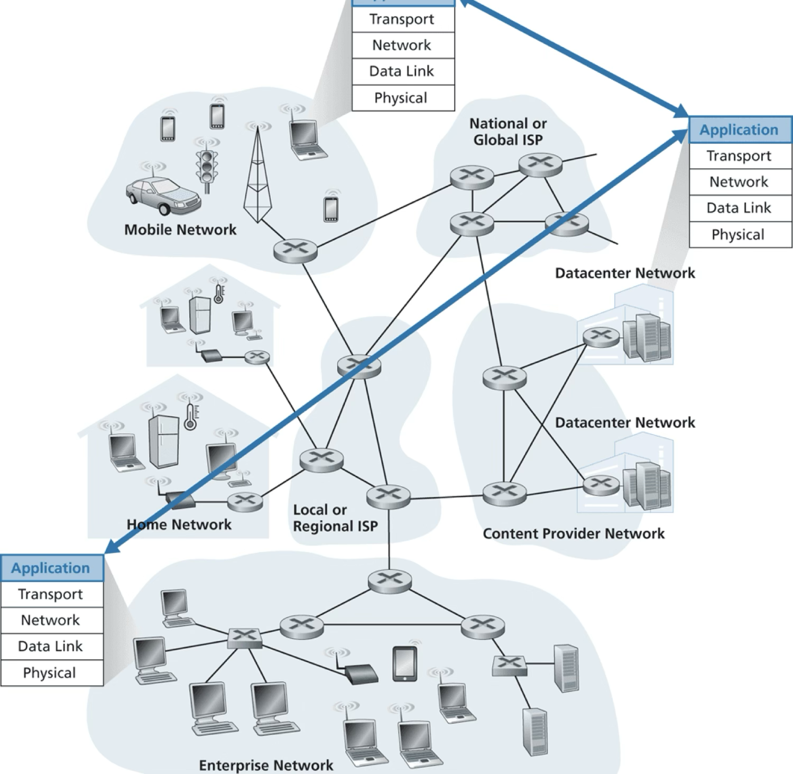

- Raisons d'etre of networks/internet
- App programs on different hosts
- Programs communicate over network
- Examples
    - Web browsers and web servers
    - Netflix apps and Netflix servers
- Key point: No app program in network core!
  - Facilitated the explosion of apps

### Architectures

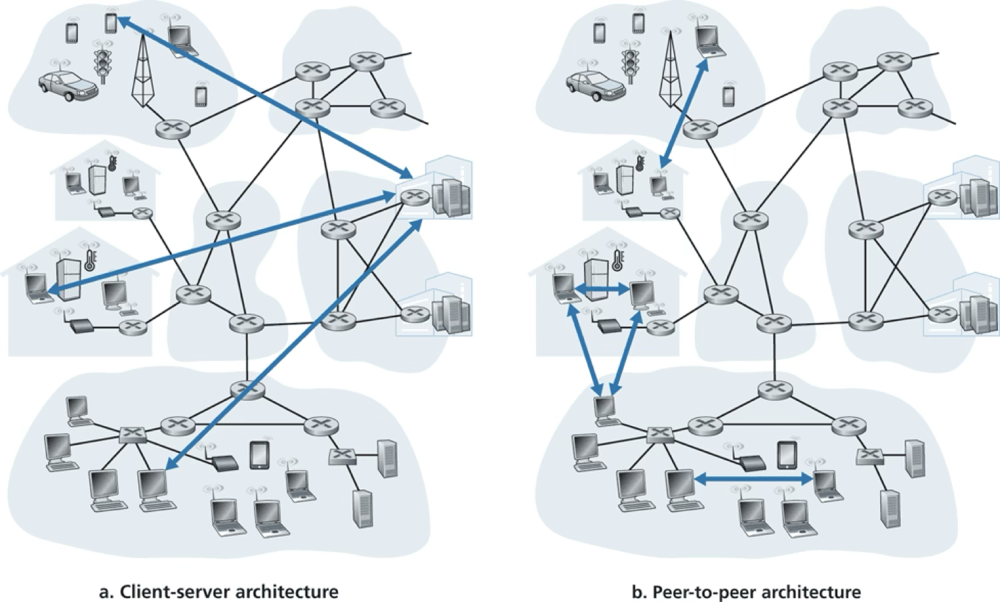

- App architecture designed by app developer
- Predominant paradigms
  - **client-server**
    - server: always-on host, listening
      - e.g. webservers for www.amazon.com in datacenters
    - client: makes requests to server
      - e.g. web browsers on user hosts
  - **peer-to-peer (P2P)** e.g. BitTorrent filesharing
    - Self-scalable BUT security, performance, reliability
    - From the trenches: BitTorrent support in AWS S3 proved problematic

### Processes Communicating

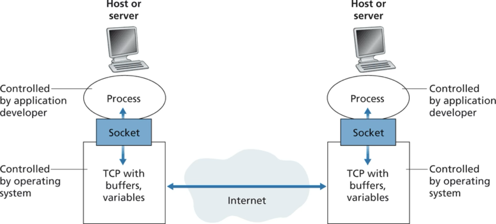

- **Process**: program on host
- Same-host processes use OS to communicate: inter-process-comm (IPC)
- Different-hosts processes exchange **messages** across the network
  - Sender/initiator: client process
  - Receiver: server process
  - (distinct from client-server architecture!)
- A process can act as both client and server in different conversations
- Client must identify the destination process. How?
- Address of the receiving host
  - **IP address**: 32-bit quantity (for now)
- Address of the process on the host
  - Port number
    - 16-bit integer 
    - e.g. 80 for a web server
    - well-known port numbers at www.iana.org
- Socket: interface to the Transport Layer to send/receive app messages
- Useful analogy
  - House = process
  - Door = socket
  - Transportation network between houses = network core
- Limited app control
  - Choice of transport protocol
  - Adjustable parameters like max segment size

### App Layer Protocols

- Defines how an app’s processes converse over the network:
  - What types of messages?
  - What’s the structure/syntax of each message?
  - What do the message fields mean?
  - What actions should processes take for each message?
- Protocol is just one, albeit important, piece of a distributed app
- Public-domain protocols specified in RFCs e.g. HTTP for the Web
- Proprietary protocols e.g. Skype's

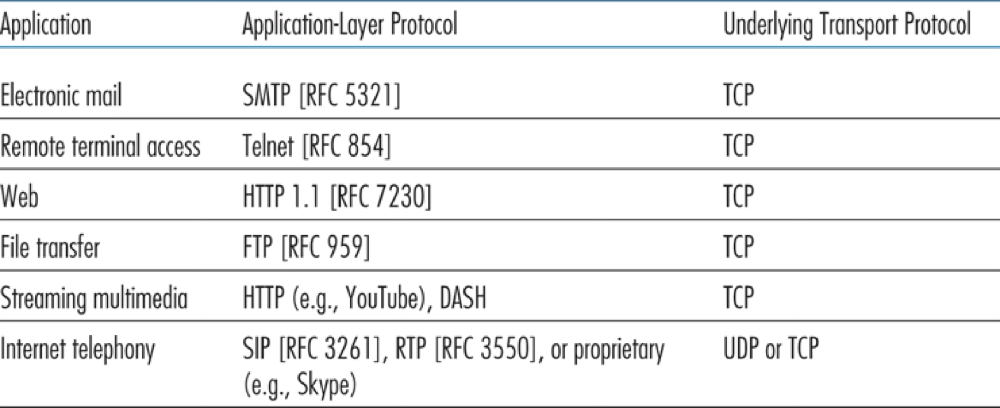

[(Back to the top)](#application-layer)

---

## Socket Programming

### UDP Server

```py
# Import socket module
from socket import *

# Create server socket that speaks UDP (transport) and IPv4 (network)
server_socket = socket(family=AF_INET, type=SOCK_DGRAM)

# Bind to a specific port
port = 12000
server_socket.bind(('', port))

# Display server address.
print("Server running on %s:%d" % (gethostbyname(gethostname()), port))

# Keep reading any incoming messages on port.
resp = "ack\n".encode()
bufsize = 4096
while True:
    msg, client_addr = server_socket.recvfrom(bufsize)
    print("Received message from %s:\n  %s" % (client_addr, msg.decode()))
    server_socket.sendto(resp, client_addr)
```

- **Netcat**: commandline utility to read/write messages across network connections
  - Send UDP messages via "-u" flag
    - e.g. *nc -u <server_ip> <server_port>*
      - ctrl-c when done

### UDP Client

```py
from socket import *

server_ip = "192.168.0.18"
server_port = 12000
msg = "Hello from vish"

# Create client socket that speaks IPv4 (network) and UDP (transport)
client_socket = socket(family=AF_INET, type=SOCK_DGRAM)

# Send message to server
client_socket.sendto(msg.encode(), (server_ip, server_port))

# Receive response from server and print it
bufsize = 4096
resp = client_socket.recv(bufsize)
print(resp.decode())

# Close client socket
client_socket.close()
```

### TCP

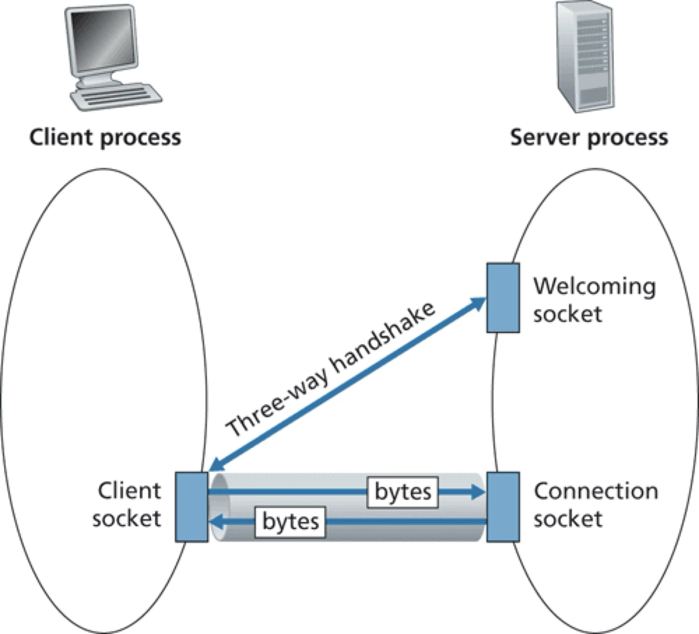

- TCP is connection-oriented
  - client and server handshake to establish a client/server sockets pair
  - analogy: knock on the welcoming door and then get assigned own door
- no need to address individual packets

#### TCP Server

```py
# Import socket module
from socket import *

# Create server socket that speaks TCP (transport) and IPv4 (network)
server_socket = socket(family=AF_INET, type=SOCK_STREAM)

# Bind to a specific port
port = 12000
server_socket.bind(('', port))

# Listen for client knocking.
backlog = 10
server_socket.listen(backlog)

# Display server address.
print("Server running on %s:%d" % (gethostbyname(gethostname()), port))

# Keep accepting new connections
resp = "ack\n".encode()
bufsize = 4096
while True:
    connection_socket, addr = server_socket.accept()
    msg = connection_socket.recv(bufsize)
    print("Received message from %s:\n  %s" % (addr, msg.decode()))
    connection_socket.send(resp)
    connection_socket.close()
```

- Can use netcat without the -u flag to send TCP messages
- Can also use telnet

#### TCP Client

```py
from socket import *

server_ip = "192.168.0.18"
server_port = 12000
msg = "Hello from vish"

# Create client socket that speaks IPv4 (network) and TCP (transport)
client_socket = socket(family=AF_INET, type=SOCK_STREAM)

# Connect to server
client_socket.connect((server_ip, server_port))

# Send message to server
client_socket.send(msg.encode())

# Receive response from server and print it
bufsize = 4096
resp = client_socket.recv(bufsize)
print(resp.decode())

# Close client socket
client_socket.close()
```

[(Back to the top)](#application-layer)

---

## Web and HTTP

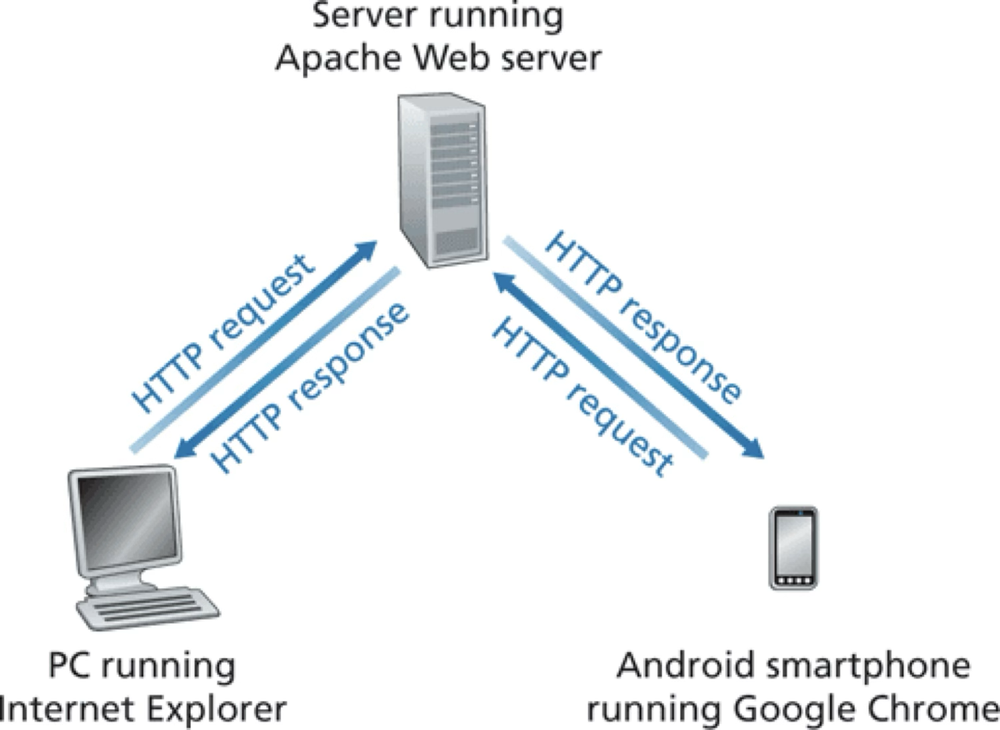

- 1990s
- Internet’s killer app that brought it to the masses
- Client: **web browser** e.g. chrome/safari/edge/firefox/etc.
  - requests docs of user’s choosing e.g. nytimes.com
- Server: **TCP server** listening on **port 80**
  - typically in org’s datacenter or cloud-hosted
- App protocol: HyperText Transfer Protocol (**HTTP**)
  - Defined in RFCs 1945, 7230, 7540
  - Spoken between web browsers and web servers
  - **Web page**: base HTML file and several referenced objects
    - object: addressable by URL
      - HTML, JPEG, Javascript, CSS, video, …
    - **URL** e.g. http://www.lwtech.edu/admissions/campus-tour.aspx
      - hostname of web server: "www.lwtech.edu"
      - object’s path name: "/admissions/campus-tour.aspx"

### HTTP Request Message

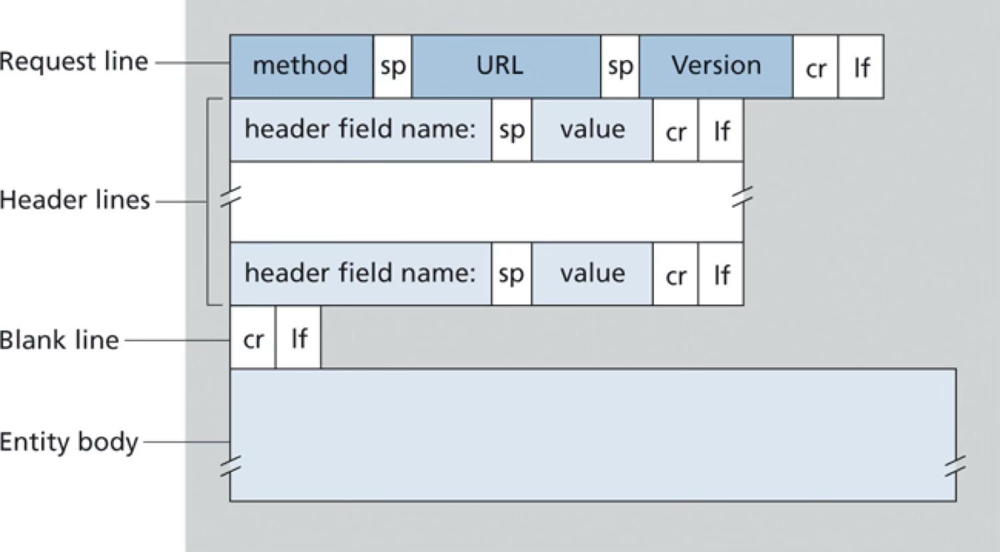

- Example

    GET /somedir/page.html HTTP/1.1 \
    Host: www.someschool.edu \
    Connection: close \
    User-agent: Mozilla/5.0 \
    Accept-language: fr 

- Human-readable ASCII text
- Methods: GET, POST, HEAD, PUT, DELETE, ...

### HTTP Response Message

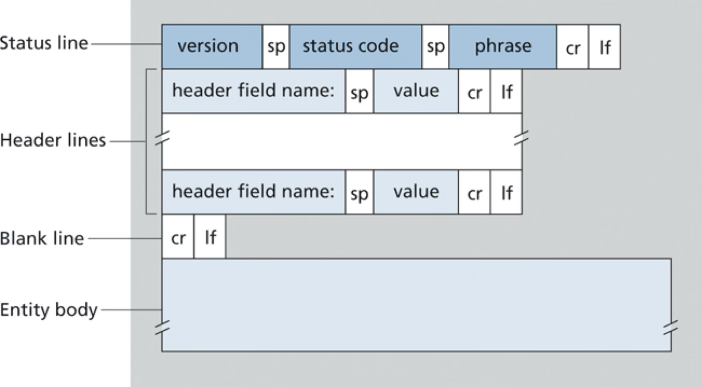

- Example

    HTTP/1.1 200 OK \
    Connection: close \
    Date: Tue, 18 August 2015 15:44:04 GMT \
    Server: Apache/2.2.3 (CentOS) \
    Last-Modified: Tue, 18 August 2015 15:11:03 GMT \
    Content-Length: 6821 \
    Content-Type: text/html \
    (data data …)

- Entity body contains the requested object

### HTTP Status Codes

- IANA maintains official registry
  - 2xx successful e.g. 200 OK
  - 3xx redirect e.g. 301 Moved Permanently
  - 4xx client error e.g. 400 Bad Request or 404 Not Found
  - 5xx server error e.g. 503 Service Unavailable
- From the trenches: important to distinguish between 4xx and 5xx to operate a service

### Demos

- Talk to Web Server

    % telnet www.google.com 80 \
    HEAD / HTTP/1.1 \
    Host: www.google.com \
    \
    HTTP/1.1 200 OK \
    Content-Type: text/html; charset=ISO-8859-1 \
    …

- Respond to browser
  - Run your own TCP server on port 80
    - Send simple HTTP response e.g. "HTTP/1.1 200 OK\n\nHello world"
  - Fetch http://localhost/ using a browser of your choice

[(Back to the top)](#application-layer)

---

## Domain Name System (DNS)

- Host IP addresses are hard to remember e.g. 142.251.33.68
- **Hostname**: mnemonic that maps to an IP address
  - e.g. www.google.com -> 142.251.33.68
- Who does the mapping? DNS
  1. Distributed database implemented in a hierarchy of DNS servers
  1. App layer protocol between hosts and DNS servers
- An internet service implemented at the application layer

Example: browser as a DNS client

1. Browser requests URL www.someschool.edu/index.html
1. Browser extracts hostname from URL and queries the DNS client running on the same machine
1. DNS client sends query to a remote DNS server
1. DNS client eventually receives reply containing IP address for hostname
1. Browser initiates TCP connection to the server process on port 80 at the IP address 

### Services Provided By DNS

- Hostname to IP address **translation**
- Host **aliasing**
  - canonical hostname e.g. relay1.west-coast.enterprise.com
  - alias hostnames e.g. enterprise.com and www.enterprise.com 
- **Mail server aliasing** e.g. johndoe@gmail.com is an alias for a more complicated gmail hostname
- **Load distribution and availability**
  - Hostname maps to a set of IPs
  - This is critical and goes way beyond mere convenience!

### Distributed Hierarchical Database

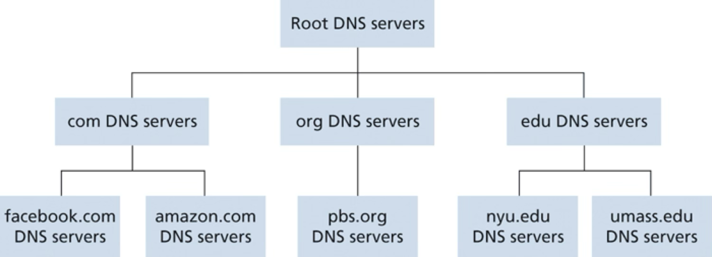

- Hierarchy of DNS servers distributed around the world
- Each server maintains a subset of the mapping
- Mainly three-level hierarchy
  - **Root**: provide IPs of top-level DNS
    - ~1,000 globally, managed by 12 organizations, coordinated through IANA
  - **Top-level domain (TLD) servers**: provides IPs of authoritative servers
    - e.g. com, org, net, edu, gov, uk, fr, ca, jp, …
  - **Authoritative DNS servers**: provides IPs of publicly addressable hosts (web servers, mail servers, etc.)
    - Each organization has its own authoritative DNS, either in-house or via a service provider

Life of a DNS query:
- www.amazon.com -> IP address?
- Root DNS returns IP of com DNS
- com DNS returns IP of amazon.com DNS
- amazon.com DNS returns IP of www.amazon.com 

### Local DNS Server

- aka **default name server**
- Each ISP provides a local DNS which hosts connect to first
  - acts as proxy to the DNS hierarchy

Example DNS lookup:

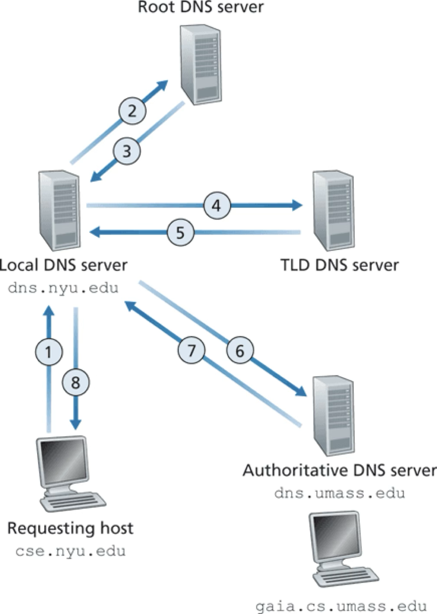

- Recursive query
  - e.g. to local name server
- Iterative queries
  - e.g. to the hierarchical DNS
- In theory, any DNS query can be iterative or recursive
  - iterative is more scalable, especially higher up the tree

### DNS Caching

- Each DNS server caches results of queries to other DNS servers in its local memory
  - Can serve queries from cache, even if not authoritative
- TTL (time-to-live) typically ~ 2 days
- Effect: root DNS bypassed for almost all DNS queries

### DNS Records

- **Resource Records (RRs)**: records stored in the DNS distributed database
- Each reply contains 1 or more RRs
- Four-tuple: (Name, Value, Type, TTL)
  - Type=**A** => Name=hostname, Value=IP
  - Type=**NS** => Name=domain (e.g. foo.com), Value=hostname of authoritative DNS
  - Type=**CNAME** => Name=alias, Value=canoncial
  - Type=**MX** => Name=alias, Value=canonical mail server

### Message Format

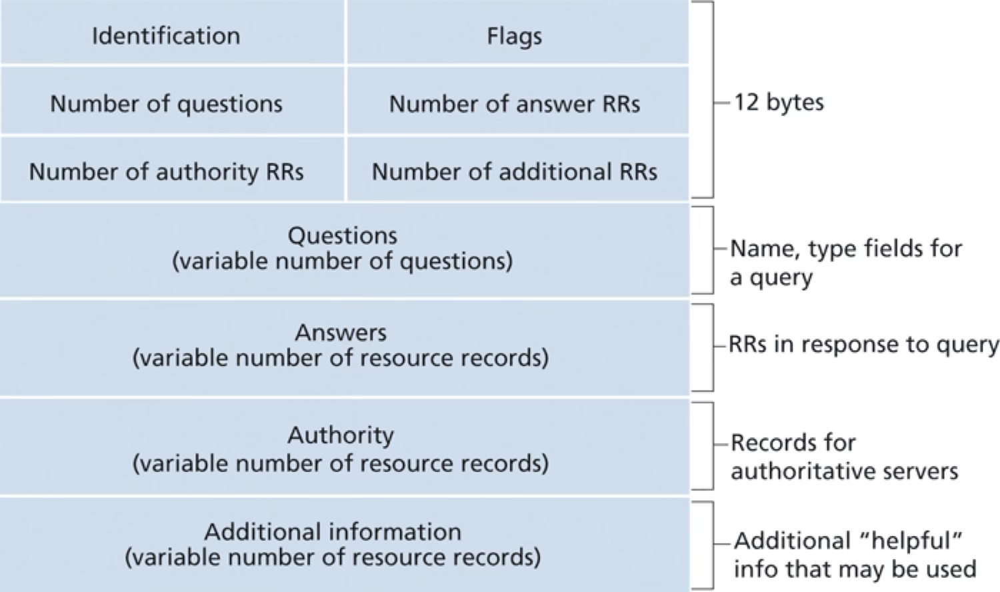

- Types
  - Query and Reply
- Format (same for both query and reply)
  - Header (12 bytes)
  - Questions section (present in Query)
    - Name and Type e.g. www.google.com, A
  - Answers section (present in Reply)
    - RRs for the questions
  - Authority section
    - Records of other authoritative servers
  - Additional section 
    - e.g. Answer section: MX record for mail server name, Additional section: 'A' record for mail server IP

### nslookup

- Commandline tool to query any DNS server
- Find the IP address of a host
  - e.g. nslookup www.mit.edu
    - Sends query to local name server (address in reply), which may respond from cache (non-authoritative) or by iteratively querying other name servers 
- Find the hostname of the authoritative DNS server for a domain
  - e.g. nslookup -type=NS mit.edu 
    - Sends query to local name server (address in reply), which may respond from cache (non-authoritative) or by iteratively querying other name servers 
    - (When -type options is not specified, it defaults to ‘A’)
- Find the IP of a hostname from its authoritative DNS server
  - e.g. nslookup www.mit.edu ns1-37.akam.net
    - Sends query to ns1-37.akam.net DNS server

[(Back to the top)](#application-layer)

---