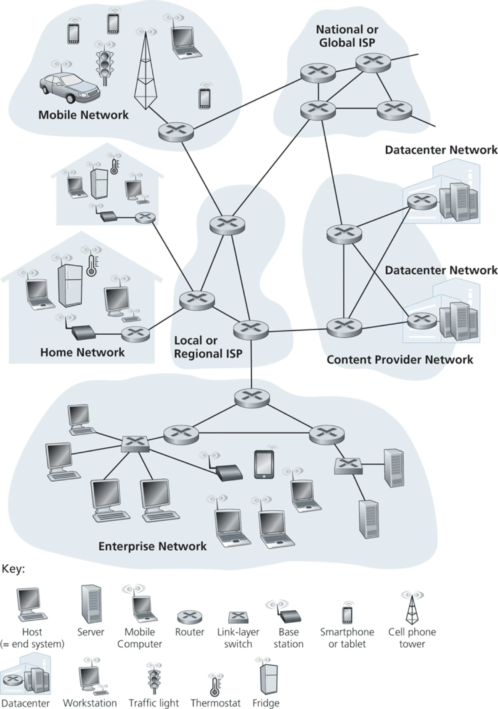
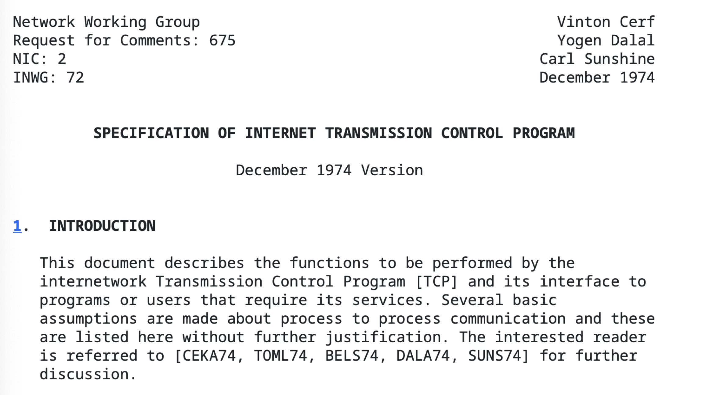
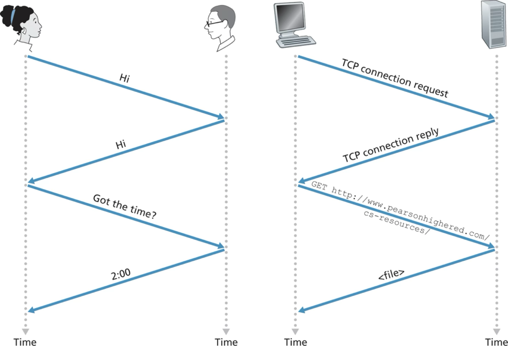
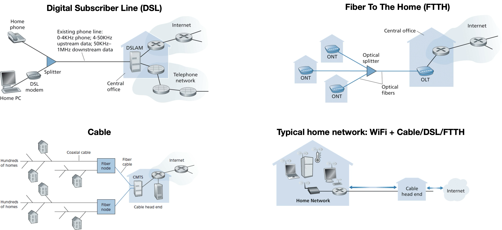
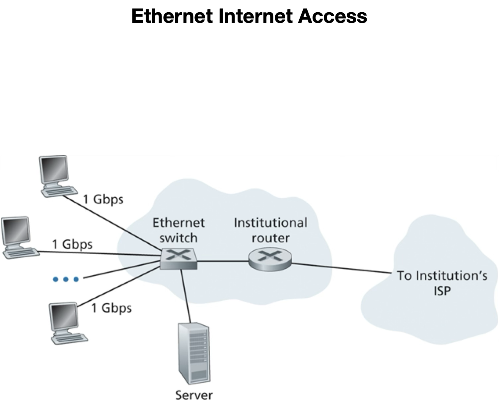
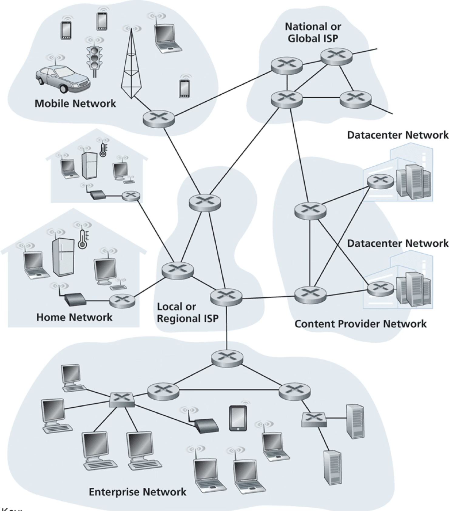

# Computer Networks and the Internet

Recommended reading: Kurose Chapter 1

- [Computer Networks and the Internet](#computer-networks-and-the-internet)
  - [10,000 Feet View](#10000-feet-view)
    - [What Is The Internet?](#what-is-the-internet)
    - [What Does The Internet Connect?](#what-does-the-internet-connect)
    - [How Does It Connect Hosts?](#how-does-it-connect-hosts)
    - [Useful Analogy](#useful-analogy)
    - [A Services Description](#a-services-description)
  - [1,000 Feet View](#1000-feet-view)
    - [Internet Protocols](#internet-protocols)
    - [What Is A Protocol?](#what-is-a-protocol)
    - [Access Networks](#access-networks)
      - [Home Access](#home-access)
      - [Enterprise Access](#enterprise-access)
      - [Wide-Area Wireless Access](#wide-area-wireless-access)
    - [Internet Service Providers (ISPs)](#internet-service-providers-isps)
- [IPv6 = (# IPv4)4](#ipv6---ipv44)
- [IPv6 = (# IPv4)4](#ipv6---ipv44-1)

## 10,000 Feet View

### What Is The Internet?

- a specific computer network
- actually a network of networks
    - Home
    - Mobile
    - Datacenter
    - …

### What Does The Internet Connect?

- **Hosts or End systems**:
    - laptops/desktops
    - servers
    - mobile devices
    - Internet of Things (IoT)
- Estimated $~10^{10}$ connected devices

### How Does It Connect Hosts?

Network of:
  - **Communication links**
  - **Packet switches**
    - **Routers**
    - **Link-layer switches**
- Annual Internet traffic $~10^{21}$ bytes (zettabytes)
    - c.f. wikipedia < 100G or $10^{11}$ bytes 
      - => 10 billion wikipedias worth annual traffic

### Useful Analogy

- Transportation network of highways, roads, and intersections
- Move cargo from one warehouse to another
  - warehouse -> *host*
  - cargo -> *message*
- Segment cargo and load onto trucks
  - truck -> *packet*
- Each truck travels independently on a road/highway
  - road/highway -> *link*
- At an intersection a truck picks the next road/highway
  - intersection -> *packet switch*
- At destination cargo is unloaded from each truck and grouped with the rest

### A Services Description

- Nuts-and-bolts is one description
- Another description: infrastructure that provides services to applications
- Distributed applications: maps, music streaming, video streaming, social media, video conferencing, multiplayer games, search, …
- Application code (e.g. in Python/Java/C++) runs on hosts
- Internet provides a socket interface for host applications to communicate
- Useful analogy: postal service

## 1,000 Feet View

### Internet Protocols

- Hosts, Switches, etc. communicate via defined protocols
- Internet’s principal protocols: TCP/IP
  - Transmission Control Protocol (TCP)
  - Internet Protocol (IP)
- Protocols defined by Internet Engineering Task Force (IETF) via Requests For Comments (RFCs)

Aside: here's the original RFC for the Internet

### What Is A Protocol?

- Send defined messages
- Take defined actions on:
  - defined responses
  - defined events
- Internet is rife with protocols between hardware/software components. Examples:
  - flow of bits between network interface cards
  - congestion control between hosts
  - routing protocols between switches
  - HTTP between web-browser and web-server

### Access Networks

- Hosts live on the “edge of the network”
- Access network connects a host to the first router aka “edge router”
- “The last mile”: typically a bottleneck

#### Home Access

(Details of each home access network not important for this class. Just know that these options exist.)

#### Enterprise Access

- Local area network (LAN) connects host to edge router
- Ethernet most prevalent LAN in corporate & university

#### Wide-Area Wireless Access

- Cellular infrastructure
- ~10 km range for access
- 3G: ~2 Mbps, 4G: ~100 Mbps, 5G: ~1 Gbps

### Internet Service Providers (ISPs)

- Hosts access Internet through ISPs
- Each ISP: network of packet switches and communication links
- Hierarchical ISPs
  - local, regional, national, international, …

Physical Media
Life of a bit
Sending host to several links and routers to the receiving host
Series of transmitter-receiver pairs
Each transmitter-receiver pair
electromagnetic wave on a physical medium
Example media: twisted-pair copper wire, coaxial cable, fiber-optic cable, terrestrial radio spectrum, and satellite radio spectrum
The Network Core
Mesh of packet switches and links that interconnects hosts
Hosts exchange messages (control, data, etc.) according to a protocol
Sender host chunks message into packets
Each packet travels through links and switches (routers and link-layer switches)
Recall cargo trucks traversing highways
Switch: receive packet from incoming link and switch it to appropriate outgoing link
Forwarding Tables and Routing Protocols
Router switches a packet from incoming link to an appropriate outgoing link. How does it select outgoing link?
A packet contains “IP address” of destination host
Router uses local forwarding table to choose outgoing link
map: destination-address-range -> outbound link
Useful analogy: car driver who prefers to ask for directions enroute
Routing protocol (non-local) updates forwarding tables
Traceroute
Traceroute
Simple program: traces route from source to destination and measures delays
Example usage: traceroute www.uni-leipzig.de 
Sends N special packets, each addressed to destination
Router i responds to packet i without further forwarding (hops TTL)
Source tracks round-trip-time (RTT)
Repeats experiment 3 times
Displays each router’s name/address and 3 RTTs
Traceroute Example
Performance
Delays
Packet journeys from source to destination via routers
Each leg of the journey can have delays
Processing, Queueing, Transmission, Propagation
Delays critical to understand when building latency-sensitive applications e.g. voice-over-IP
Processing Delay
Time required to process the packet for routing
Determine destination, check for integrity, consult forwarding table, etc.
Typically < 1 microsecond
Queueing Delay
Time spent waiting in the output link’s queue of pending packets
Router has a queue per outbound link
Depends on intensity and nature of traffic
Can vary from packet to packet
Typically between microseconds and milliseconds
Transmission Delay
Time required to place the packet on the outbound link
Packet of L bits on a R bits/s link => L/R seconds delay
e.g. 1K packet on 100 Mbps ethernet link => ~10 microseconds
Analogy: width of pipe
Propagation Delay
Time required to propagate a packet on the link to the next router
Depends on link medium
Bounded by speed of light
Rule of thumb: 1 ms per 100 miles
Analogy: length of pipe
Queueing Delay and Packet Loss
Per-link output buffer has a finite capacity
(Aside: when is it ok to have an unbounded queue in any system?)
Router drops packet if link’s queue is full
Packet enters the internet core but doesn’t emerge
Router performance: queueing delay and packet loss
From the trenches: packet loss frequently the reason for high e2e inter-datacenter latency at AWS and Google Cloud
Throughput
Network performance metrics: delay, packet loss, and throughput
e.g. file of F bits transferred from host A to host B in T seconds 
avg. throughput = F / T bps
Some apps are throughput-sensitive e.g. data backup
Useful analogy: bits as fluid and links as pipes
width -> throughput
length -> propagation delay
Throughput
Bandwidth R: max throughput on a link
Example (a)
Throughput = min(RS, RC)
Example (b)
Throughput = min(R1, R2, …, RN)
Concept of a bottleneck link
Throughput
Suppose all links in the network core have bandwidth >> access links RC or RS
Example (a): throughput = min(RS, RC)
Typical bottleneck: access links
Example (b): throughput = min(RS, RC, R/10)
Internet core can be a bottleneck if there’s high intervening traffic
Traceroute Example
Protocol Layers
Analogy: Airline System
Complex system composed of simpler layers
Each layer implements a service e.g baggage check and claim
“separation of concerns”
Each layer can be changed without disrupting the entire complex system
Layering pros: simplicity + modularity
Layering cons: redundancies across layers
Internet Protocol Stack
Internet protocol layers form a protocol stack
A protocol layer can be implemented in hardware or software
Typically upper layers in software and lower layers in hardware
Application Layer
The protocol that a distributed app uses to communicate among its processes
Packet: message
Examples
HTTP for world-wide-web
SMTP for email
FTP for file transfer
DNS for host names
Your protocol for your app!
Transport Layer
Transports app layer messages from one process on a host to another process on another host
Packet: segment
Examples
TCP
Connection-oriented
Guaranteed delivery
Flow control
Congestion control
UDP
No-frills connectionless delivery
Network Layer
Transports transport layer segments from source host to destination host
Packet: datagram
Examples
IP
The glue that binds the internet
Routing protocols
Link Layer
Transports network layer datagram from one node to another node on a link
Packet: frame
Examples
Ethernet
WiFi
Datagrams typically traverse multiple links each with its own Link Layer protocol
Physical Layer
Transports individual bits within a link frame from one node to the next
Examples
Ethernet on twisted-pair copper
Ethernet on coaxial cable
Ethernet on fiber
Link-medium dependent
Traversing The Protocol Stack
Message path from source process to destination process
Down source stack
Up to link-layer in LAN switch and down again
Up to network-layer in router and down again
Up destination stack
Packet switches don’t implement all layers of the protocol stack! 
Complexity pushed to edges.
Encapsulation across protocol layers
Traversing The Protocol Stack
Useful analogy: interoffice memo via postal service
Alice sends a memo to Bob
app-layer message
interoffice envelope
transport-layer segment
postal envelope
network-layer datagram
Networks Under Attack
Common Attacks
Malware: malicious software
(Distributed) Denial-of-Service or (D)DoS
Access link bandwidth flooding
TCP connection flooding
From the trenches: DoS Server at Google
Packet sniffing
wireshark is a packet sniffer!
IP spoofing: inject packets with false source address
Approach
Computer Networks and the Internet
Top-down networking stack
Application Layer
Transport Layer
Network Layer
Wireshark: Getting Started
What Is Wireshark?
A packet sniffer
captures copies of packets sent/received on computer
Get Started
Download and install on your laptop
http://www.wireshark.org/download.html
Test run
Start a browser
Start Wireshark
Start capturing packets on the relevant network interface
Enter a URL in your browser
e.g. http://gaia.cs.umass.edu/wireshark-labs/INTRO-wireshark-file1.htm 
Stop packet capture
Filter for “http”
Screenshot
Application Layer
Recommended reading: Kurose chapter 2
Overview
Raisons D’etre of Networks
Overview
App programs on different hosts
Programs communicate over network
Examples
Web browsers and web servers
Netflix apps and Netflix servers
Key point: No app program in network core!
Facilitated the explosion of apps
Architectures
App architecture designed by app developer
Predominant paradigms
client-server
server: always-on host, listening
e.g. webservers for www.amazon.com in datacenters
client: makes requests to server
e.g. web browsers on user hosts
peer-to-peer (P2P) e.g. BitTorrent filesharing
Self-scalable BUT security, performance, reliability
From the trenches: BitTorrent support in AWS S3 proved problematic
Processes Communicating
Process: program on host
Same-host processes use OS to communicate: inter-process-comm (IPC)
Different-hosts processes exchange messages across the network
Sender/initiator: client process
Receiver: server process
(distinct from client-server architecture!)
A process can act as both client and server in different conversations
Addressing Processes
Client must identify the destination process. How?
Address of the receiving host
IP address: 32-bit quantity (for now)
Address of the process on the host
Port number
16-bit integer 
e.g. 80 for a web server
well-known port numbers at www.iana.org
Socket Interface
Socket: interface to the Transport Layer to send/receive app messages
Useful analogy
House = process
Door = socket
Transportation network between houses = network core
Limited app control
Choice of transport protocol
Adjustable parameters like max segment size
Transport Requirements
Internet’s Transport
TCP
Connection-oriented (full duplex)
Reliable
no missing/duplicate/unordered bytes
Congestion control
Flow control
Internet’s Transport
TLS (Transport Layer Security)
TCP enhanced with
encryption
data integrity
end-point authentication
Not strictly a transport protocol but rather app-layer enhancement of TCP
No Bandwidth/Latency Guarantees!?
Neither TCP nor UDP provide any throughput/latency guarantees
Still, latency-sensitive apps (e.g. VoIP) and bandwidth-sensitive apps (e.g. video streaming) thrive
Apps designed to be resilient to bandwidth/latency issues
To an extent
Works well, except when it doesn’t => outages/degradation
App Layer Protocols
Defines how an app’s processes converse over the network:
What types of messages?
What’s the structure/syntax of each message?
What do the message fields mean?
What actions should processes take for each message?
Protocol is just one, albeit important, piece of a distributed app
App Layer Protocols
Public-domain protocols specified in RFCs e.g. HTTP for the Web
Proprietary protocols e.g. Skype's
Socket Programming
UDP Server
import socket  # socket module
server_socket = socket
Demo
I’ll run a server
You send messages to it
Using “netcat”: command line utility to read/write messages across network connections
e.g. nc - u <server_ip> <server_port>
ctrl-c when done
UDP Client
import socket  # socket module
server_socket = socket
Demo
I’ll run the server
You send messages to it
Using your own UDP client!
Using TCP
TCP is connection-oriented
client and server handshake to establish a client/server sockets pair
analogy: knock on the welcoming door and then get assigned own door
no need to address individual packets
TCP Server
import socket  # socket module
server_socket = socket
Demo
I’ll run a TCP server
You send messages to it
Using “netcat”: command line utility to read/write messages across network connections
e.g. nc <server_ip> <server_port>
ctrl-c when done
TCP Client
import socket  # socket module
server_socket = socket
Demo
I’ll run a TCP server
You send messages to it
Using your own TCP client!
Web and HTTP
World Wide Web
1990s
Internet’s killer app that brought it to the masses
Client: web browser e.g. chrome/safari/edge/firefox/etc.
requests docs of user’s choosing e.g. nytimes.com
Server: TCP server listening on port 80
typically in org’s datacenter or cloud-hosted
App protocol: HyperText Transfer Protocol (HTTP)
HTTP: Overview
Defined in RFCs 1945, 7230, 7540
Spoken between web browsers and web servers
Web page: base HTML file and several referenced objects
object: addressable by URL
HTML, JPEG, Javascript, CSS, video, …
URL e.g. http://www.lwtech.edu/admissions/campus-tour.aspx
hostname of web server
object’s path name
HTTP Request Message
Example
GET /somedir/page.html HTTP/1.1
Host: www.someschool.edu
Connection: close
User-agent: Mozilla/5.0
Accept-language: fr
Human-readable ASCII text
Methods
GET, POST, HEAD, PUT, DELETE
HTTP Response Message
Example
HTTP/1.1 200 OK
Connection: close
Date: Tue, 18 August 2015 15:44:04 GMT
Server: Apache/2.2.3 (CentOS)
Last-Modified: Tue, 18 August 2015 15:11:03 GMT
Content-Length: 6821
Content-Type: text/html
(data data …)
Entity body contains the requested object
HTTP Status Codes
IANA maintains official registry
2xx successful e.g. 200 OK
3xx redirect e.g. 301 Moved Permanently
4xx client error e.g. 400 Bad Request or 404 Not Found
5xx server error e.g. 503 Service Unavailable
From the trenches: important to distinguish between 4xx and 5xx to operate a service
Demo: Talk To Web Server
Demo: Respond To Browser
Run your own TCP server on port 80
Have it respond with a simple HTTP response with simple text body, regardless of request method
e.g. "HTTP/1.1 200 OK\n\nHello world"
Fetch http://<ip>/ using a browser of your choice
HTTP Interactions
Interactions when user clicks a hyperlink
Takes 2 RTTs (round-trip-time)
RTT: Duration of packet from client to server and back
Includes delays (processing, queueing, transmission, propagation)
Persistent connections in HTTP/1.1 to allow for subsequent HTTP requests to reuse the same connection
Default mode: persistent w/ pipelining
More HTTP
Stateless protocol
HTTP server maintains no info on clients
BUT cookies mechanism to have clients store and echo state
HTTP versions
HTTP/1.0 : original version from the 1990s [RFC 1945]
HTTP/1.1 : popular version today [RFC 7230]
persistent connections
HTTP/2 : [RFC 7540]
site performance and server efficiency
HTTP/3 : not yet standardized
Networking Project

DNS
(Domain Name System)
DNS: Overview
Host IP addresses are hard to remember e.g. 142.251.33.68
Hostname: mnemonic that maps to an IP address
e.g. www.google.com -> 142.251.33.68
Who does the mapping? DNS
Distributed database implemented in a hierarchy of DNS servers
App layer protocol between hosts and DNS servers
An internet service implemented at the application layer
Example: Browser as DNS client
Browser requests URL www.someschool.edu/index.html
Browser extracts hostname from URL and queries the DNS client running on the same machine
DNS client sends query to a remote DNS server
DNS client eventually receives reply containing IP address for hostname
Browser initiates TCP connection to the server process on port 80 at the IP address 
DNS Services
Hostname to IP address translation
Host aliasing
canonical hostname e.g. relay1.west-coast.enterprise.com
alias hostnames e.g. enterprise.com and www.enterprise.com 
Mail server aliasing e.g. johndoe@gmail.com is an alias for a more complicated gmail hostname
Load distribution and availability
Hostname maps to a set of IPs
This is critical and goes way beyond mere convenience!
How DNS Does Not Work
One DNS server that contains all the mappings?!
Simple, BUT doesn’t scale
Single point of failure for the entire internet
Can’t handle internet’s traffic volume
Can’t be close to clients so long delays
Too much data
Too many updates when hosts change
Distributed Hierarchical Database
Hierarchy of DNS servers distributed around the world
Each server maintains a subset of the mapping
Mainly three-level hierarchy
Root: provide IPs of top-level DNS
~1,000 globally, managed by 12 organizations, coordinated through IANA
Top-level domain (TLD) servers: provides IPs of authoritative servers
e.g. com, org, net, edu, gov, uk, fr, ca, jp, …
Verisign maintains com, Educause maintains edu, …
Authoritative DNS servers: provides IPs of publicly addressable hosts (web servers, mail servers, etc.)
Each organization has its own authoritative DNS, either in-house or via a service provider
DNS Root Servers in 2020
Distributed Hierarchical Database
Life of a DNS query
www.amazon.com -> IP address?
Root DNS returns IP of com DNS
com DNS returns IP of amazon.com DNS
amazon.com DNS returns IP of www.amazon.com 
Local DNS Server
aka default name server
Each ISP provides a local DNS which hosts connect to first
acts as proxy to the DNS hierarchy
Example Lookup
Recursive query
e.g. to local name server
Iterative queries
e.g. to the hierarchical DNS
In theory, any DNS query can be iterative or recursive
iterative is more scalable, especially higher up the tree
DNS Caching
Each DNS server caches results of queries to other DNS servers in its local memory
Can serve queries from cache, even if not authoritative
TTL (time-to-live) typically ~ 2 days
Effect: root DNS bypassed for almost all DNS queries
DNS Records
Resource Records (RRs): records stored in the DNS distributed database
Each reply contains 1 or more RRs
Four-tuple: (Name, Value, Type, TTL)
Type=A => Name=hostname, Value=IP
Type=NS => Name=domain (e.g. foo.com), Value=hostname of authoritative DNS
Type=CNAME => Name=alias, Value=canoncial
Type=MX => Name=alias, Value=canonical mail server
DNS Messages
Types
Query and Reply
Format (same for both query and reply)
Header (12 bytes)
Identification (2 bytes): id of query and reply
Flags (2 bytes)
query or reply
Is authoritative server
Is recursion desired
Is recursion supported
4 Numbers fields describing the data sections
DNS Messages
Questions section (present in Query)
Name and Type
e.g. www.google.com, A
Answers section (present in Reply)
RRs for the questions
Possibly multiple RRs for the same question (e.g. if hostname maps to several IPs)
DNS Messages
Authority section
Records of other authoritative servers
Additional section 
e.g. Answer section: MX record for mail server name, Additional section: A record for mail server IP
Demo: nslookup (1)
Commandline tool to query any DNS server
Find the IP address of a host
e.g. nslookup www.mit.edu
Sends query to local name server (address in reply), which may respond from cache (non-authoritative) or by iteratively querying other name servers 
Demo: nslookup (2)
Find the hostname of the authoritative DNS server for a domain
e.g. nslookup -type=NS mit.edu 
Sends query to local name server (address in reply), which may respond from cache (non-authoritative) or by iteratively querying other name servers 
(When -type options is not specified, it defaults to ‘A’)
Demo: nslookup (3)
Find the IP of a hostname from its authoritative DNS server
e.g. nslookup www.mit.edu ns1-37.akam.net
Sends query to ns1-37.akam.net DNS server
Tale From The Trenches
Amazon S3 DNS “hack”
Objects (blobs) stored with <bucket>/<object> naming scheme
Each <bucket> located in a particular datacenter
User in Tokyo reading a bucket in Seattle
DNS lookup for <bucket>.aws.s3.com returns an IP in Japan
Request enters Amazon’s network in Japan (frontend server)
Amazon’s network used to transfer data from Seattle to Tokyo
Tale From The Trenches
Goal: route user request to the datacenter where their data is
How? build an S3 DNS server
Insert DNS record for each bucket to map to IPs in local datacenter
Then <bucket>.aws.s3.com resolves to an IP for a host in the target datacenter
Approach
Computer Networks and the Internet
Top-down networking stack
Application Layer
Transport Layer
Network Layer
Transport Layer
Recommended reading: Kurose chapter 3
Transport Overview
Transport Overview
Logical communication between app processes on different hosts
Only on end hosts, not in network core
Transport Overview
Process-to-process channel (logical) 
Only on the edge (hosts)
not in the core (routers)
Multiplexing and Demultiplexing
Sender side
Receives app message via socket
Wraps message in transport-layer segments
wrap = prefix transport header
Passes to network layer for delivery to host: multiplexing
Receiver side
Receives segment from network layer
Unwraps app message
Delivers to app via socket (based on header): demultiplexing
Multiplexing and Demultiplexing
Sender side multiplexing
App-layer message via 1 of N sockets -> 1 network-layer datagram
Encapsulation
wrap via prefixing header
message -> segment -> datagram
Receiver side demultiplexing
1 network-layer datagram -> app-layer message via 1 of N sockets
De-encapsulation
unwrap via removing header prefix
datagram -> segment -> message
Useful Analogy
Two houses, one on East Coast and one on West Coast
Each house has a dozen kids
Kids in one house are cousins of kids in other house
Ever week, each kid writes a letter to every one of their cousins
Ann (West Coast) and Bill (East Coast) collect letters and hand off to postal-service mail-carrier (and also deliver incoming letters to siblings)
Internet’s Transports
UDP (User Datagram Protocol)
Unreliable, connectionless (Ann/Bill careless)
TCP (Transmission Control Protocol)
Reliable, connection-oriented (Ann/Bill careful)
UDP
UDP
Defined in RFC 768
8 bytes header
Dest. port for receiver-side demultiplexing
(dest. IP, dest. port) -> Receiver socket
Source port for receiver to reply to the sender (swapping src/dst ports aka “port inversion”)
Length: # bytes in segment (header + data)
Checksum: detect corruption/errors
UDP
Defined in RFC 768
8 bytes header
Dest. port for receiver-side demultiplexing
(dest. IP, dest. port) -> Receiver socket
Source port for receiver to reply to the sender (swapping src/dst ports aka “port inversion”)
Length: # bytes in segment (header + data)
Checksum: detect corruption/errors
Port Inversion
Layering
Why UDP?
Low latency (no connection establishment)
reason why DNS uses UDP
App control over when data sent
No congestion control
Handle more connections
No connection state overhead
BUT typically need non-trivial app logic to address unreliability
UDP on Wireshark
TCP
TCP
Defined in RFCs 793, 1122, 2018, 5681, 7323
Src & dst ports, and checksum (ala UDP)
Sequence & Acknowledgement numbers (for reliable data transfer)
Receive window (for flow control)
Header length (20 bytes w/o options)
Options (variable length) (e.g. negotiate MSS or window scaling factor
6 flag bits (details later)
TCP
Defined in RFCs 793, 1122, 2018, 5681, 7323
Src & dst ports, len, and checksum (ala UDP)
Sequence & Acknowledgement numbers (for reliable data transfer)
Receive window (for flow control)
Header length (20 bytes w/o options) (c.f. 8 bytes for UDP)
Options (variable length) (e.g. negotiate MSS or window scaling factor)
6 flag bits (details later)
Layering
TCP Mux/Demux
Example
Host C has 2 HTTP sessions with host B
Host A has 1 HTTP session with host B
TCP “listening socket” accepts connection and creates a connection-socket
Connection socket identified by four-tuple: (src IP, src port, dst IP, dst port)
c.f. UDP two-tuple (dst IP, dst port)
Src port is used for demux in addition to port inversion in replies
TCP Mux/Demux
Example
Host C has 2 HTTP sessions with host B
Host A has 1 HTTP session with host B
TCP “listening socket” accepts connection and creates a connection-socket
Connection socket identified by four-tuple: (src IP, src port, dst IP, dst port)
c.f. UDP two-tuple (dst IP, dst port)
Src port is used for demux in addition to port inversion in replies
Tale From The Trenches
Amazon’s S3 outage in 2008
Single host with a corrupting network interface that eluded TCP checksums!
S3 servers “gossiped” about the state of S3 servers
The one misinformation spreader prevented gossip from converging to the actual state
The entire system had to be shutdown and brought back up
Lesson: End-to-end integrity checks are critical!
TCP Connection
Three-way handshake
SYN segment
SYN + random initial seq num
SYNACK segment
Allocates buffers/variables
SYN + random initial seq num + ack
ACK segment
Allocates buffers/variables
next seq num (w/ piggybacked payload) + ack
1 RTT for connection establishment
TCP Connection
Three-way handshake
Client sends SYN segment (synchronize)
SYN + random initial-seq-num (isn)
1st byte of sent data will have seq-num (sn) = isn+1
Server responds with SYNACK segment
Allocates buffers/variables
SYN + random isn + ack
Ack sn = sn of byte the server expects to receive next
ACK segment
Allocates buffers/variables
next seq num (w/ piggybacked payload) + ack
1 RTT for connection establishment
SYN (Wireshark)
SYNACK (Wireshark)
ACK (Wireshark)
TCP Buffers
TCP buffers data on send/recv hosts
Buffered data transmitted in segments
MSS: max app data in segment
Not max segment size, despite the name!
Based on link-layer MTU (max transmission unit)
1500 bytes for Ethernet
40 bytes of TCP/IP headers => 1460 MSS
Spec: “send that data in segments at its own convenience”
TCP Buffers
TCP buffers data on send/recv hosts
Buffered data transmitted in segments
MSS: max app data in segment
Not max segment size, despite the name!
Based on link-layer MTU (max transmission unit)
1500 bytes for Ethernet
40 bytes of TCP/IP headers => 1460 MSS
Spec: “send data in segments at its own convenience”
TCP Reliability
Guarantees
No lost data
No duplicate data
No out-of-order data
How?
Sequence numbers
Acknowledgement numbers
Retransmits
Sequence Numbers
Data = implicitly ordered stream of bytes
Sequence number for segment = byte number of 1st data byte in segment (base initial-seq-num + 1)
Example: message of 500,000 bytes, MSS of 1,000 bytes
Segment 1: seq-num offset 0
Segment 2: seq-num offset 1,000
… for 500 segments
Random initial sequence number: protects against latent segments from a previous connection incarnation
Sequence Numbers
Data = implicitly ordered stream of bytes
Sequence number for segment = byte number of 1st data byte in segment (base initial-seq-num + 1)
Example: message of 500,000 bytes, MSS of 1,000 bytes
Segment 1: seq-num offset 0
Segment 2: seq-num offset 1,000
… for 500 segments
Random initial sequence number: protects against latent segments from a previous connection incarnation
Acknowledgment Numbers
Set by the receiver of data
Sequence number of the next data byte the receiver expects from the sender
All data bytes up to that number have been successfully received
cumulative acknowledgement
Handling out of order segments is left up to the implementation (discard or buffer)
Example echo server
Acknowledgment Numbers
Example: echo server
Set by the receiver of data
Sequence number of the next data byte the receiver expects from the sender
All data bytes up to that number have been successfully received
cumulative acknowledgement
Handling out of order segments is left up to the implementation (discard or buffer)
Retransmits
Retransmit segment if not acked within timeout
Timeout = estimated-RTT + 4 x deviation-RTT
Retransmits
Retransmit segment if not acked within timeout
Timeout = estimated-RTT + 4 x deviation-RTT
estimated-RTT = exponentially-weighted-moving-average (EWMA)
Resiliency against segment losses
Flow Control
Prevent sender from overflowing receive buffer
Distinct from congestion control
Receiver tracks receive window (rwnd) and includes it in every segment it sends to sender
Sender keeps unacked bytes below rwnd
Flow Control
Prevent sender from overflowing receive buffer
Distinct from congestion control
Receiver tracks receive window (rwnd) and includes it in every segment it sends to sender
Sender keeps unacked bytes below rwnd
Window Scaling
16 bits rwnd => 64 Kilobytes of unacked data
Bandwidth-delay product of a link
How much data is unacked in link
Long Fat Network (LFN)
e.g. 10 Mbit/s link with 100 ms propagation RTT
=> 1 Mbit or ~125 KB unacked in link
=> max of 64 KB rwnd too small!
Congestion Control: Principles
How does sender limit rate?
cwnd: congestion window
unacked-bytes <= min{cwnd, rwnd}
send rate ~ wnd/RTT bytes/sec
How does sender detect congestion?
Loss events
timeout for ack-wait
duplicate acks (when receiving out-of-order segments)
Slow Start
Start of TCP connection: cwnd = 1 MSS
Every ack => cwnd = cwnd + 1 MSS
Exponential increase: doubles every RTT
cwnd (in MSS) = 1, 2, 4, 8, … 
When cwnd >= ssthresh
Transition to congestion-avoidance
Loss event
restart slow start
ssthresh = cwnd / 2
Slow Start
Start of TCP connection: cwnd = 1 MSS
Every ack => cwnd = cwnd + 1 MSS
Exponential increase: doubles every RTT
cwnd (in MSS) = 1, 2, 4, 8, … 
When cwnd >= ssthresh (slow-start-threshold)
Transition to congestion-avoidance
Loss event
restart slow start
ssthresh = cwnd / 2
Tale From The Trenches
Google early days
Low latency for web apps
Otherwise users will not adopt
HTTP response for www.google.com optimized to fit in 1 MSS!
1 RTT response time
Can’t do better than that
Congestion Avoidance
Additive increase rather than exponential increase
Every ack: cwnd = cwnd + MSS / cwnd 
=> Every RTT: cwnd = cwnd + 1 MSS
c.f. Every ack: cwnd = cwnd + 1 MSS => every RTT: cwnd = cwnd * 2
Multiplicative decrease on loss event
cwnd = cwnd / 2
AIMD (Additive Increase Multiplicative Decrease
sawtooth behavior of cwnd
From the trenches: AIMD in app-layer congestion avoidance in Google’s cache-invalidation system!
TCP Disconnection
Either side can end the connection
Resources (buffers/variables) released
Example: client initiates close
Client closes only after
ACK received from server
FIN received from server
Wait time elapsed e.g. to resend a lost ack
TCP Disconnection
Either side can end the connection
Resources (buffers/variables) released
Example: client initiates close
Client closes only after
ACK received from server
FIN received from server
Wait time elapsed e.g. to resend a lost ack
TCP Client States
TCP Server States
TCP on Wireshark
Approach
Computer Networks and the Internet
Top-down networking stack
Application Layer
Transport Layer
Network Layer
Network Layer: Data Plane
Recommended reading: Kurose chapter 4
Network Overview
Example: host H1 sends msg to host H2
H1: transport segments -> network datagrams
H1 -> R1 -> … -> R2 -> H2
H2: network datagrams -> transport segments 
Network layer in all hosts and routers in network
Network Overview
Example: host H1 sends msg to host H2
H1: transport segments -> network datagrams
H1 -> R1 -> … -> R2 -> H2
H2: network datagrams -> transport segments 
Network layer in all hosts and routers in network
Network layer processed in each node on src -> dst path
Not like app and transport layers which are end-to-end
Forwarding and Routing
Network layer: move packets from sending host to reaching host
Forwarding (data plane): incoming link -> outgoing link
router-local
hardware (fast)
Routing (control plane): end-to-end path
network-wide
software (slower)
Forwarding and Routing
Network layer: move packets from sending host to reaching host
Forwarding (data plane): incoming link -> outgoing link
router-local
hardware (fast)
Routing (control plane): end-to-end path
network-wide
software (slower)
Inside A Router
Input Ports
e.g. 800 100 Gbps ethernet ports
don’t confuse with tcp port
forwarding table lookup
Switching Fabric
data packet to output port
control packet to routing processor
Output Ports
Routing processor
executes routing protocols
computes forwarding tables
Destination-Based Forwarding
Use packet’s destination IP address to determine output port
IPv4 32-bits => 4 billion possibilities
Prefix based routing instead
longest prefix matching rule
hardware logic
Net Neutrality
Routers can use different packet scheduling mechanisms e.g. FIFO, Priority Queue, etc.
US “net neutrality”: FCC 2015
No Blocking of lawful content
No Throttling of lawful traffic
No Paid Prioritization of some traffic
IPv4
Version (4 bits): 4 for IPv4, 6 for IPv6
Header length (4 bits): to account for Options (w/o options, 20 bytes)
Type of service (8 bits): e.g. real-time telephony vs non-real-time FTP
Datagram length (16 bits): header + data
Identifier, flags, fragmentation offset (32 bits): large datagram fragmentation and reassembly
IPv4
Version (4 bits): 4 for IPv4, 6 for IPv6
Header length (4 bits): to account for Options (w/o options, 20 bytes)
Type of service (8 bits): e.g. real-time telephony vs non-real-time FTP
Datagram length (16 bits): header + data
Identifier, flags, fragmentation offset (32 bits): large datagram fragmentation and reassembly
IPv4
Version (4 bits): 4 for IPv4, 6 for IPv6
Header length (4 bits): to account for Options (w/o options, 20 bytes)
Type of service (8 bits): e.g. real-time telephony vs non-real-time FTP
Datagram length (16 bits): header + data
Identifier, flags, fragmentation offset (32 bits): large datagram fragmentation and reassembly
IPv4
Time-to-live: decremented by 1 at each router and discarded when 0
Upper Protocol: used at destination host
TCP = 6, UDP = 17
Analogous to TCP segment port number
Header checksum: bit errors in datagram
recomputed and stored at each router (e.g. TTL changes)
Why here and in the Transport layer?
IPv4
Version (4 bits): 4 for IPv4, 6 for IPv6
Header length (4 bits): to account for Options (w/o options, 20 bytes)
Type of service (8 bits): e.g. real-time telephony vs non-real-time FTP
Datagram length (16 bits): header + data
Identifier, flags, fragmentation offset (32 bits): large datagram fragmentation and reassembly
IPv4
Src/dst IPv4 addresses
Options
rarely used
removed in IPv6
Data
typically, transport layer segment
or network layer control msgs e.g. ICMP
Layering Examples
IPv4 Addressing
Network interface: boundary between host/router and physical link
IP address for every network interface
typically 1 for a host, many for a router
32 bits or 4 bytes => 232 possible IPs
Dotted-decimal notation e.g. 193.32.216.9
Each IP globally unique (except for IPs behind NATs)
IPv4 Addressing
Network interface: boundary between host/router and physical link
IP address for every network interface
typically 1 for a host, many for a router
32 bits or 4 bytes => 232 possible IPs
Dotted-decimal notation e.g. 193.32.216.9
Each IP globally unique (except for IPs behind NATs)
IPv4 Addressing
Example: 1 router interconnecting 7 hosts
24-bits common prefix for 3 hosts and 1 router interface (223.1.1.xxx)
subnet 
subnet mask 223.1.1.0/24 (“slash 24”)
LAN interconnected with no routers e.g. ethernet or WiFi
Other subnets
223.1.2.0/24 and 223.1.3.0/24
IPv4 Addressing
Example: 1 router interconnecting 7 hosts
24-bits common prefix for 3 hosts and 1 router interface (223.1.1.xxx)
subnet 
subnet mask 223.1.1.0/24 (“slash 24”)
LAN interconnected with no routers e.g. ethernet or WiFi
Other subnets
223.1.2.0/24 and 223.1.3.0/24
CIDR
Classless Interdomain Routing (CIDR, pronounced cider)
Internet’s address assignment strategy
Generalizes the notion of subnet addressing
32-bit IP divided into two parts
Address Allocation
Internet Corporation for Assigned Names and Numbers (ICANN)
Non-profit that manages:
IP blocks allocation
DNS root servers
Domain name assignments
Host IP within org with a block of IPs
Manually or Dynamic Host Configuration Protocol (DHCP) 
NAT
Strategy for assigning IPs to small subnets (e.g. home networks)
NAT-enabled router
home interface interconnects 10.0.0.0/24 subnet
10.0.0.0/8 = private network block (RFC 1918)
Single IP for outside world (e.g. 138.76.29.7)
Port numbers used in NAT translation
NAT
Strategy for assigning IPs to small subnets (e.g. home networks)
NAT-enabled router
home interface interconnects 10.0.0.0/24 subnet
10.0.0.0/8 = private network block (RFC 1918)
Single IP for outside world (e.g. 138.76.29.7)
Port numbers used in NAT translation
NAT
Strategy for assigning IPs to small subnets (e.g. home networks)
NAT-enabled router
home interface interconnects 10.0.0.0/24 subnet
10.0.0.0/8 = private network block (RFC 1918)
Single IP for outside world (e.g. 138.76.29.7)
Port numbers used in NAT translation
NAT Example
Host 10.0.0.1 requests a web page from 128.119.40.186:80
Host assigns a src port 3345 and sends datagram into LAN
NAT router translates source IP and port to 138.76.29.7 5001 and sends datagram
NAT router receives response datagram from web server and translates into local IP port and routes to host via home network
IPv6
Primary motivation: IPv4 address exhaustion
128 bits or 16 bytes (4x IPv4)
# IPv6 = (# IPv4)4
every grain of sand is addressable
Streamlined 40-byte header
No fragmentation/reassembly
“Packet Too Big” ICMP error
No header checksum
Rely on Transport and Link layers
No Options section
IPv6
Primary motivation: IPv4 address exhaustion
128 bits or 16 bytes (4x IPv4)
# IPv6 = (# IPv4)4
every grain of sand is addressable
Streamlined 40-byte header
No fragmentation/reassembly
“Packet Too Big” ICMP error
No header checksum
Rely on Transport and Link layers
No Options section
IPv4 -> IPv6
Can’t shutdown the internet for a bit!
Need to interoperate between the 2 versions
Tunneling
Wrap IPv6 packet in IPv4 to tunnel through IPv4 routers
Set IPv4 upper protocol field to 41 so that the IPv6 receiver can unwrap
IPv4 -> IPv6
Can’t shutdown the internet for a bit!
Need to interoperate between the 2 versions
Tunneling
Wrap IPv6 packet in IPv4 to tunnel through IPv4 routers
Set IPv4 upper protocol field to 41 so that the IPv6 receiver can unwrap
Approach
Computer Networks and the Internet
Top-down networking stack
Application Layer
Transport Layer
Network Layer
Data Plane
Network Layer: Control Plane
Recommended reading: Kurose chapter 5
Forwarding and Routing
Network layer: move packets from sending host to reaching host
Forwarding (data plane): incoming link -> outgoing link
router-local
hardware (fast)
Routing (control plane): end-to-end path
network-wide
software (slower)
Forwarding and Routing
Network layer: move packets from sending host to reaching host
Forwarding (data plane): incoming link -> outgoing link
router-local
hardware (fast)
Routing (control plane): end-to-end path
network-wide
software (slower)
Routing Algorithms
Routing Algorithms
Goal: determine good paths/routes, from senders to receivers, through network of routers
“good”: least cost (e.g. length or speed or $ of link)
respecting policy constraints
“path/route”: sequence of routers from sender to receiver
Formulation: graph G = (N, E)
set of N nodes (routers) and E edges (links)
Routing Algorithms
Routing Algorithms
Example: least cost path from node u to z
Classification
Centralized aka Link-State (LS)
uses complete, global knowledge of network
Decentralized aka Distance-Vector (DV)
no node has complete information
nodes compute routes iteratively via exchanging info
Link-State (LS) Routing Algo
Complete knowledge => each node broadcasts link-state packets to all other nodes
Dijkstra’s algorithm
computes least-cost path from source node (e.g. u) to all other nodes
iterative: after kth iteration, paths known to k nodes
Notation
D(v): cost of current least-cost path from source to v
p(v): previous node (neighbor of v) along current least-cost path
N’: subset of nodes; v is in N’ if least-cost path to v is known 
Dijkstra: Algo
Dijkstra: Dry Run
Dijkstra: Dry Run
Dijkstra: Dry Run
Dijkstra: Dry Run
Dijkstra: Dry Run
Dijkstra: Path
Distance-Vector (DV) Routing Algo
Distributed: each node exchanges info with direct neighbors
Iterative: continues until no more chatter
Asynchronous: nodes operate independently, not in lock-step
Based on the intuitive Bellman-Ford equation

DV Example
