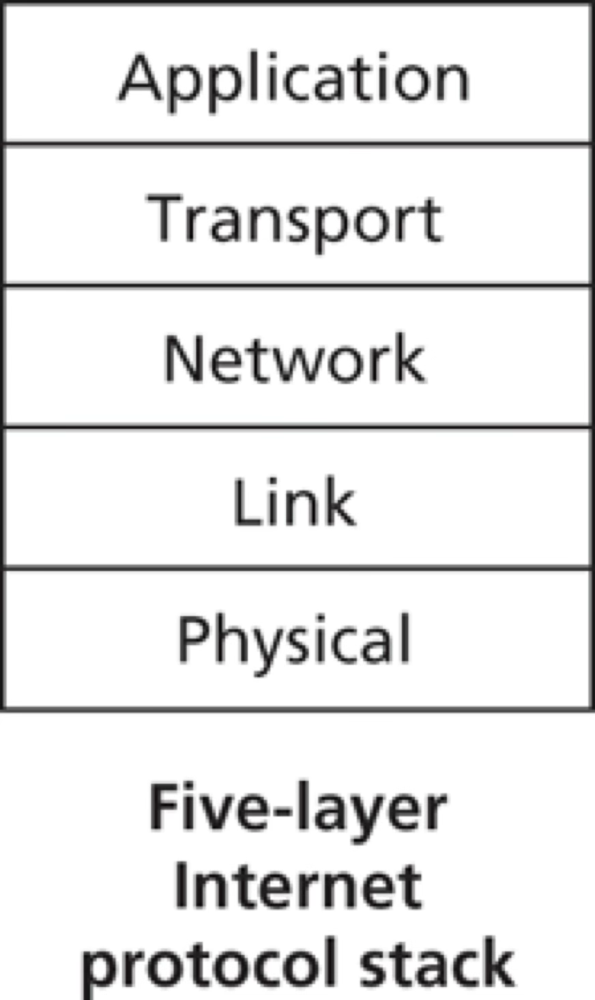

# Computer Networks and the Internet

[(Up to Overview)](../index)

Recommended reading: Kurose Chapter 1

- [Computer Networks and the Internet](#computer-networks-and-the-internet)
  - [10,000 Feet View](#10000-feet-view)
    - [What Is The Internet?](#what-is-the-internet)
    - [What Does The Internet Connect?](#what-does-the-internet-connect)
    - [How Does It Connect Hosts?](#how-does-it-connect-hosts)
    - [Useful Analogy](#useful-analogy)
    - [A Services Description](#a-services-description)
  - [1,000 Feet View](#1000-feet-view)
    - [Internet Protocols](#internet-protocols)
    - [What Is A Protocol?](#what-is-a-protocol)
    - [Access Networks](#access-networks)
    - [The Network Core](#the-network-core)
    - [Forwarding Tables and Routing Protocols](#forwarding-tables-and-routing-protocols)
  - [Traceroute](#traceroute)
  - [Performance](#performance)
    - [Delays](#delays)
      - [Processing Delay](#processing-delay)
      - [Queueing Delay](#queueing-delay)
      - [Transmission Delay](#transmission-delay)
      - [Propagation Delay](#propagation-delay)
    - [Packet Loss](#packet-loss)
    - [Throughput](#throughput)
  - [Protocol Layers](#protocol-layers)
    - [Analogy: Airline System](#analogy-airline-system)
    - [Internet Protocol Stack](#internet-protocol-stack)
      - [Application Layer](#application-layer)
      - [Transport Layer](#transport-layer)
      - [Network Layer](#network-layer)
      - [Link Layer](#link-layer)
      - [Physical Layer](#physical-layer)
    - [Traversing The Protocol Stack](#traversing-the-protocol-stack)

## 10,000 Feet View

### What Is The Internet?

- a specific computer network
- actually a network of networks
    - Home
    - Mobile
    - Datacenter
    - …

### What Does The Internet Connect?

- **Hosts or End systems**:
    - laptops/desktops
    - servers
    - mobile devices
    - Internet of Things (IoT)
- Estimated $~10^{10}$ connected devices

### How Does It Connect Hosts?

Network of:
  - **Communication links**
  - **Packet switches**
    - **Routers**
    - **Link-layer switches**
- Annual Internet traffic $~10^{21}$ bytes (zettabytes)
    - c.f. wikipedia < 100G or $10^{11}$ bytes 
      - => 10 billion wikipedias worth annual traffic

### Useful Analogy

- Transportation network of highways, roads, and intersections
- Move cargo from one warehouse to another
  - warehouse -> *host*
  - cargo -> *message*
- Segment cargo and load onto trucks
  - truck -> *packet*
- Each truck travels independently on a road/highway
  - road/highway -> *link*
- At an intersection a truck picks the next road/highway
  - intersection -> *packet switch*
- At destination cargo is unloaded from each truck and grouped with the rest

### A Services Description

- Nuts-and-bolts is one description
- Another description: infrastructure that provides services to applications
- Distributed applications: maps, music streaming, video streaming, social media, video conferencing, multiplayer games, search, …
- Application code (e.g. in Python/Java/C++) runs on hosts
- Internet provides a socket interface for host applications to communicate
- Useful analogy: postal service

## 1,000 Feet View

### Internet Protocols

- Hosts, Switches, etc. communicate via defined protocols
- Internet’s principal protocols: TCP/IP
  - Transmission Control Protocol (TCP)
  - Internet Protocol (IP)
- Protocols defined by Internet Engineering Task Force (IETF) via Requests For Comments (RFCs)

Aside: here's the original RFC for the Internet

### What Is A Protocol?

- Send defined messages
- Take defined actions on:
  - defined responses
  - defined events
- Internet is rife with protocols between hardware/software components. Examples:
  - flow of bits between network interface cards
  - congestion control between hosts
  - routing protocols between switches
  - HTTP between web-browser and web-server

### Access Networks

- Hosts live on the “edge of the network”
- Access network connects a host to the first router aka “edge router”
- “The last mile”: typically a bottleneck
- Home Access
  - DSL
  - Cable
  - Fiber
- Enterprise Access
  - Local area network (LAN) connects host to edge router
  - Ethernet most prevalent LAN in corporate & university
- Wide-Area Wireless Access
  - Cellular infrastructure
  - ~10 km range for access
  - 3G: ~2 Mbps, 4G: ~100 Mbps, 5G: ~1 Gbps

### The Network Core

- Mesh of **packet switches** and **links** that interconnects hosts
- Hosts exchange messages (control, data, etc.) according to a protocol
- Sender host chunks message into packets
- Each packet travels through links and switches (routers and link-layer switches)
  - Recall cargo trucks traversing highways
- Switch: receive packet from incoming link and switch it to appropriate outgoing link

### Forwarding Tables and Routing Protocols

- Router switches a packet from incoming link to an appropriate outgoing link. How does it select outgoing link?
- A packet contains “IP address” of destination host
- Router uses *local* **forwarding table** to choose outgoing link
- map: destination-address-range -> outbound link
- Useful analogy: car driver who prefers to ask for directions enroute
- **Routing protocol** (*non-local*) updates forwarding tables

## Traceroute

- Simple program: traces route from source to destination and measures delays
- Example usage: traceroute www.uni-leipzig.de 
- Sends N special packets, each addressed to destination
- Router i responds to packet i without further forwarding (hops TTL)
- Source tracks round-trip-time (RTT)
- Repeats experiment 3 times
- Displays each router’s name/address and 3 RTTs

Example:

## Performance

### Delays

- Packet journeys from source to destination via routers
- Each leg of the journey can have delays
  - Processing, Queueing, Transmission, Propagation
- Delays critical to understand when building latency-sensitive applications e.g. voice-over-IP

#### Processing Delay

- Time required to process the packet for routing
  - Determine destination, check for integrity, consult forwarding table, etc.
- Typically < 1 microsecond
- Not terribly interesting

#### Queueing Delay

- Time spent waiting in the output link’s queue of pending packets
  - Router has a queue per outbound link
  - Depends on intensity and nature of traffic
    - Can vary from packet to packet
- Typically between microseconds and milliseconds
- This is the main source of performance variation

#### Transmission Delay

- Time required to place the packet on the outbound link
  - Packet of L bits on a R bits/s link => L/R seconds delay
  - e.g. 1K packet on 100 Mbps ethernet link => ~10 microseconds
- Analogy: width of pipe

#### Propagation Delay

- Time required to propagate a packet on the link to the next router
  - Depends on link medium
  - Bounded by speed of light
  - Rule of thumb: 1 ms per 100 miles
- Analogy: length of pipe

### Packet Loss

- Per-link output buffer has a finite capacity
  - (Aside: when is it ok to have an unbounded queue in any system?)
- Router drops packet if link’s queue is full
  - Packet enters the internet core but doesn’t emerge
- Router performance: queueing delay and packet loss
- From the trenches: packet loss frequently the reason for high e2e inter-datacenter latency at AWS and Google Cloud

### Throughput

- Network performance metrics: delay, packet loss, and throughput
- e.g. file of F bits transferred from host A to host B in T seconds 
  - avg. throughput = F / T bps
- Some apps are throughput-sensitive e.g. data backup
- Useful analogy: bits as fluid and links as pipes
  - width -> throughput
  - length -> propagation delay

- Bandwidth R: max throughput on a link
- Example (a)
  - Throughput = min($R_S, R_C$)
- Example (b)
  - Throughput = min($R_1, R_2, …, R_N$)
- Concept of a **bottleneck link**

- Suppose all links in the network core have bandwidth >> access links $R_C or R_S$
- Example (a): throughput = min($R_S, R_C$)
  - Typical bottleneck: access links
- Example (b): throughput = min($R_S, R_C, R/10$)
  - Internet core can be a bottleneck if there’s high intervening traffic

## Protocol Layers

### Analogy: Airline System

- Complex system composed of simpler layers
- Each layer implements a service e.g baggage check and claim
  - “separation of concerns”
- Each layer can be changed without disrupting the entire complex system
- Layering pros: simplicity + modularity
- Layering cons: redundancies across layers

### Internet Protocol Stack

- Internet protocol layers form a protocol stack
- A protocol layer can be implemented in hardware or software
- Typically upper layers in software and lower layers in hardware

#### Application Layer

- The protocol that a distributed app uses to communicate among its processes
- Packet: **message**
- Examples
  - HTTP for world-wide-web
  - SMTP for email
  - FTP for file transfer
  - DNS for host names
  - Your protocol for your app!

#### Transport Layer

- Transports app layer messages from one process on a host to another process on another host
- Packet: **segment**
- Examples
  - TCP
    - Connection-oriented
    - Guaranteed delivery
    - Flow control
    - Congestion control
  - UDP
    - No-frills connectionless delivery

#### Network Layer

- Transports transport layer segments from source host to destination host
- Packet: **datagram**
- Examples
  - IP
    - The glue that binds the internet
  - Routing protocols

#### Link Layer

- Transports network layer datagram from one node to another node on a link
- Packet: **frame**
- Examples
  - Ethernet
  - WiFi
- Datagrams typically traverse multiple links each with its own Link Layer protocol

#### Physical Layer

- Transports individual bits within a link frame from one node to the next
- Examples
  - Ethernet on twisted-pair copper
  - Ethernet on coaxial cable
  - Ethernet on fiber
- Link-medium dependent

### Traversing The Protocol Stack

- Message path from source process to destination process
  - Down source stack
  - Up to link-layer in LAN switch and down again
  - Up to network-layer in router and down again
  - Up destination stack
- Packet switches don’t implement all layers of the protocol stack! 
  - Complexity pushed to edges.
- Encapsulation across protocol layers
- Useful analogy: interoffice memo via postal service
  - Alice sends a memo to Bob
    - app-layer message
  - interoffice envelope
    - transport-layer segment
  - postal envelope
    - network-layer datagram