# Network Layer

[(Up to Overview)](../index)

Recommended reading: Kurose chapters 4 and 5

- [Network Layer](#network-layer)
  - [Overview](#overview)
    - [What Does It Do?](#what-does-it-do)
    - [How Does It Do It?](#how-does-it-do-it)
    - [Aside: Net Neutrality](#aside-net-neutrality)
  - [Data Plane (Forwarding)](#data-plane-forwarding)
    - [How To Choose The Outgoing Link?](#how-to-choose-the-outgoing-link)
      - [Exercises](#exercises)
    - [IPv4](#ipv4)
      - [Layering Examples](#layering-examples)
      - [Exercises](#exercises-1)
    - [Addressing](#addressing)
      - [CIDR](#cidr)
      - [Address Allocation](#address-allocation)
      - [Network Address Translation (NAT)](#network-address-translation-nat)
      - [Exercises](#exercises-2)
    - [IPv6](#ipv6)
      - [Migrating from IPv4 to IPv6](#migrating-from-ipv4-to-ipv6)
  - [Control Plane (Routing)](#control-plane-routing)
    - [Routing Algorithms](#routing-algorithms)
    - [Link-State Routing Algorithm](#link-state-routing-algorithm)
      - [Exercises](#exercises-3)
    - [Distance-Vector Routing Algorithm](#distance-vector-routing-algorithm)
      - [Exercises](#exercises-4)

## Overview

### What Does It Do?

> The network layer moves datagrams from the sending host to the receiving host via intermediate routers.

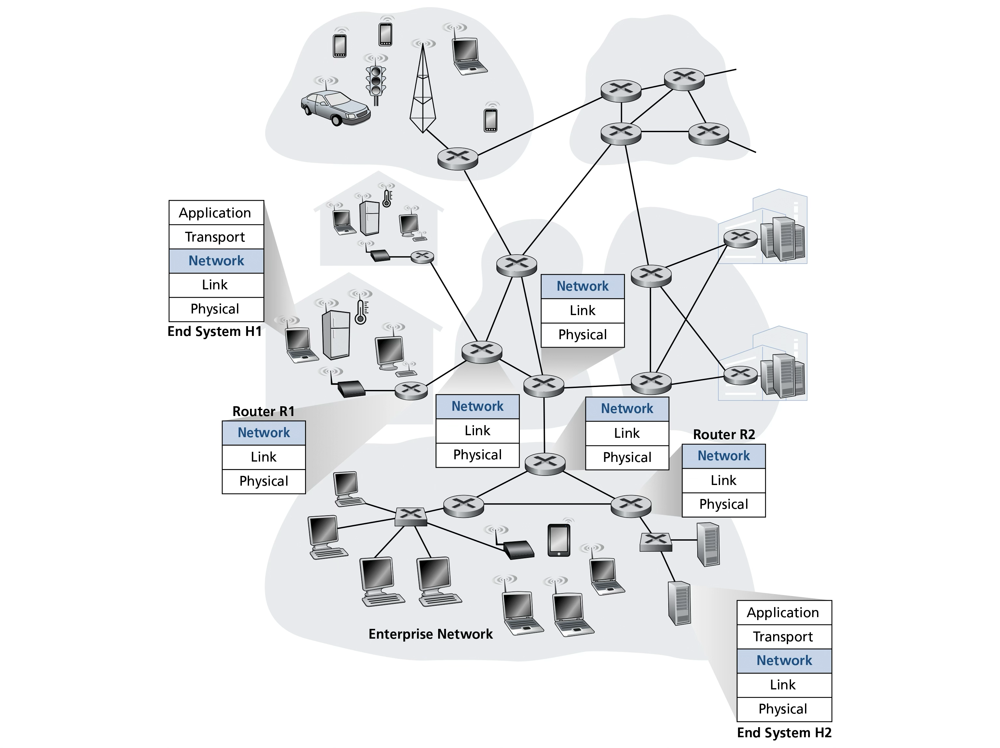

- Example: host H1 sends msg to host H2
    - H1: ... -> transport segments -> network datagrams -> ...
    - H1 -> R1 -> … -> R2 -> H2
      - Up to network layer involved in each hop
    - H2: ... -> network datagrams -> transport segments -> ...
- Network layer used in all nodes in network:
    - hosts
    - packet-switches
        - link-layer switches
        - routers
- c.f. app and transport layers which are only used on end systems (hosts)

### How Does It Do It?

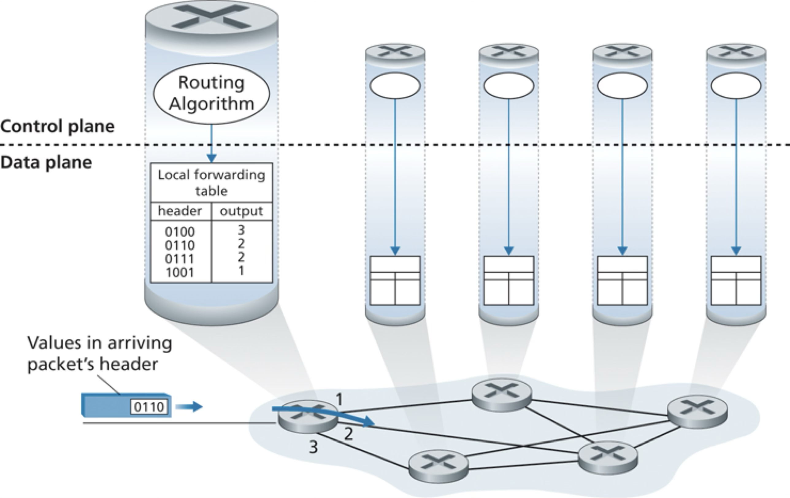

1. **Forwarding** (**data plane**)
    - Move datagram from **incoming link to appropriate outgoing link**
    - router-local
    - hardware (fast)
1. **Routing** (**control plane**)  
    - Determine good **end-to-end paths** and update router-local forwarding info
    - network-wide
    - software (slower)

### Aside: Net Neutrality

- "With great power comes great responsibility"
- Routers control the flow of internet traffic
  - Can choose different scheduling mechanisms for queues
    - e.g. FIFO, Priority Queue, etc.
- BUT must follow US “net neutrality”: FCC 2015
  - No Blocking of lawful content
  - No Throttling of lawful traffic
  - No Paid Prioritization of some traffic

[Back to top](#network-layer)

---

## Data Plane (Forwarding)

Recall:

> Forwarding = packet-switch moves a datagram from the **incoming link to an appropriate outgoing link**

### How To Choose The Outgoing Link?

- Use info in the network-layer header
- What info? the datagram's destination host identified by an IP address
  - Known as **destination-based forwarding**
  - Network-layer Protocol: **IP** (v4 or v6)
- **Forwarding table**:
  - map: *destination-IP* -> *outbound-link*
- Problem
  - too many possible destinations => large forwarding table
      - e.g. ~4 billion IPv4 addresses
  - Solution: **IP-prefix routing**
    - Longest prefix match

Example forwarding table:
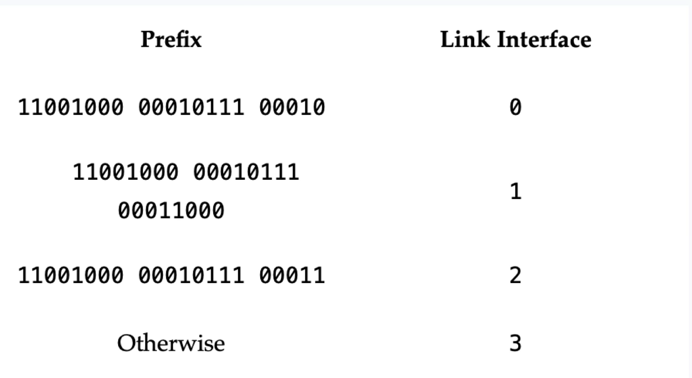

---

#### Exercises

1. Consider the network below. 

    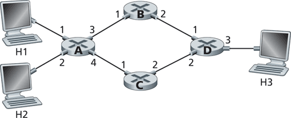

     1. What is router A's forwarding table entry such that all traffic destined to host H3 is forwarded through interface 3? <!-- NETWO-n65Ry --> 

         
         
         
         

    1. What is A's forwarding table entry such that all traffic from H1 to H3 uses interface 3 and all traffic from H2 to H3 uses interface 4? <!-- NETWO-gpJOU -->

         
         
         
         

2. Consider a datagram network using 8-bit host addresses. Suppose a router uses longest prefix matching and has the following forwarding table:

    | Prefix Match | Interface |
    | ------------ | --------- |
    | 1            | 0         |
    | 10           | 1         |
    | 111          | 2         |
    | otherwise    | 3         |

    For each of the four interfaces, give the associated range of destination host addresses and the number of addresses in the range. <!-- NETWO-BDwdV -->

       
       
       
       
       
       
       
       

[Back to the top](#network-layer)

---

### IPv4

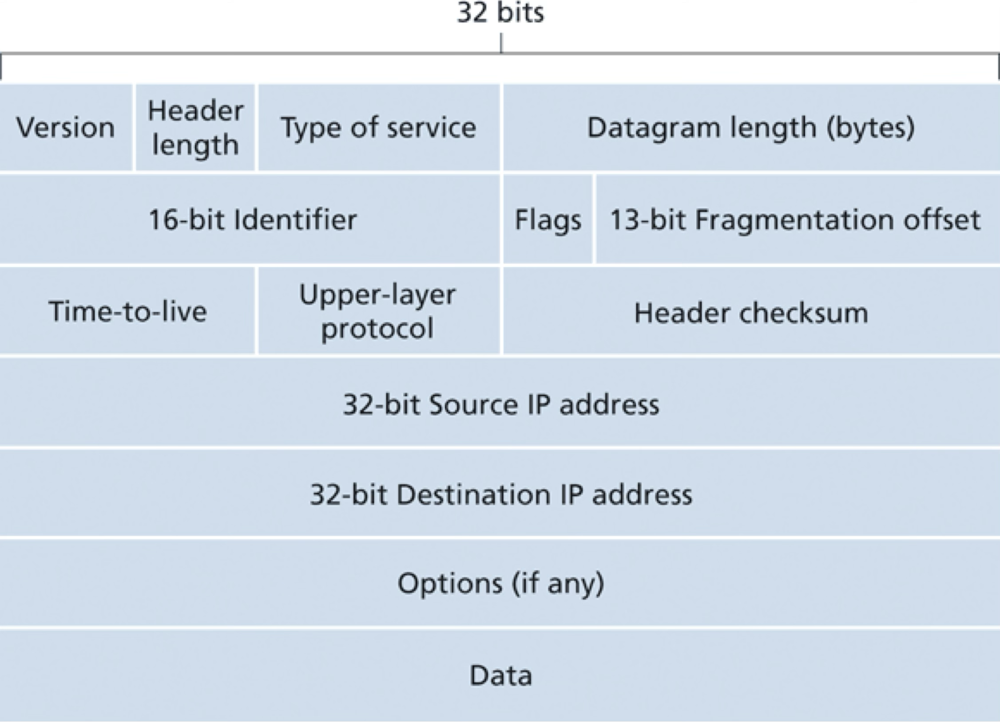

- Version (4 bits)
  - 4 for IPv4, 6 for IPv6
  - First thing in the header, to know how to parse the rest of the header
- Header length (4 bits)
  - to account for Options (w/o options, 20 bytes)
- Type of service (8 bits)
  - e.g. real-time telephony vs non-real-time FTP
- Datagram length (16 bits)
  - header + data
- Identifier, flags, fragmentation offset (32 bits)
  - large datagram fragmentation and reassembly
  - removed in IPv6!
- Time-to-live
  - decremented by 1 at each router and discarded when 0
- Upper Protocol
  - used at destination host
  - TCP = 6, UDP = 17
  - Analogous to TCP segment port number
- Header checksum
  - bit errors in datagram
  - recomputed and stored at each router (e.g. TTL changes)
  - Removed in IPv6!
- **Src/dst IPv4 addresses**
- Options
  - rarely used
  - removed in IPv6!
- **Data**
  - typically, transport layer segment or network layer control msgs e.g. ICMP

#### Layering Examples

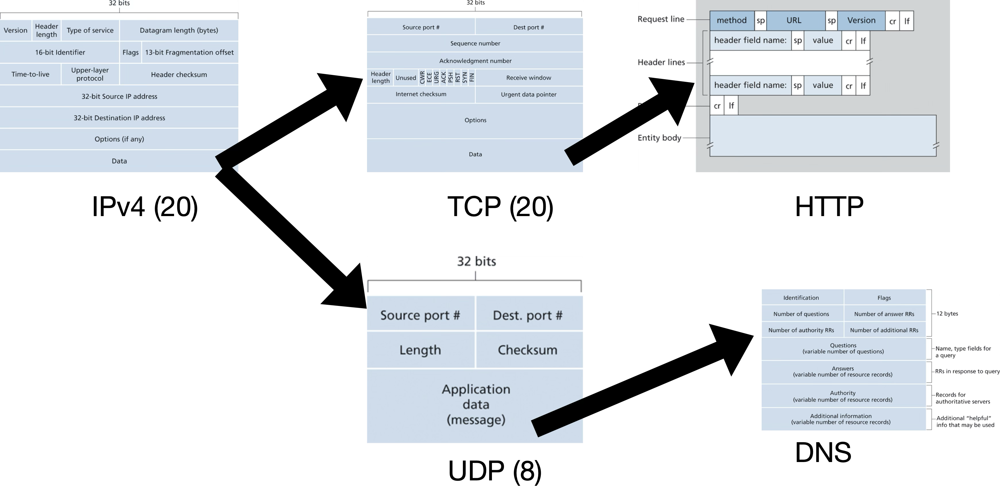

#### Exercises

1. How does IPv4 ensure that a datagram is forwarded through no more than N routers? <!-- NETWO-KpO6F -->

     
     
     
     

2. Suppose Host A sends Host B a TCP segment encapsulated in an IP datagram. When Host B receives the datagram, how does its network layer know it should pass the segment (i.e. the payload of the datagram) to TCP rather than to UDP or some other transport-layer protocol? <!-- NETWO-voEYl -->

     
     
     
     

3. Suppose an application generates chunks of 40 bytes of data every 30 msec, and each chunk is sent over the network via TCP and IPv4. What percentage of each network-layer datagram will be overhead (i.e. protocol headers)? <!-- NETWO-9xysP -->

     
     
     
     
     
     
     
     

[Back to the top](#network-layer)

---

### Addressing

- **Network interface**
  - boundary between host/router and physical link
- IP address for every network interface
  - typically 1 for a host, many for a router
- 32 bits or 4 bytes => $2^{32}$ possible IPs
- Dotted-decimal notation e.g. 193.32.216.9
- Each IP globally unique (except for IPs behind NATs)

Example: one router interconnecting 7 hosts
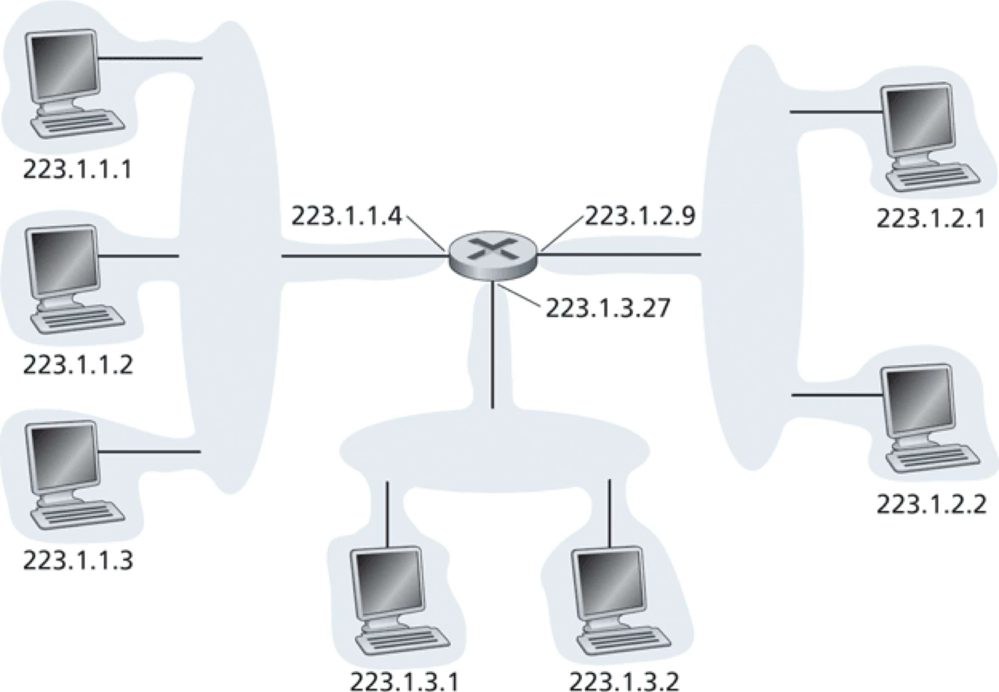

- 24-bits common prefix for 3 hosts and 1 router interface (223.1.1.xxx)
  - **subnet** 
  - **subnet mask** 223.1.1.0/24 (“slash 24”)
  - LAN interconnected with no routers e.g. ethernet or WiFi
- Other subnets
  - 223.1.2.0/24 and 223.1.3.0/24

#### CIDR

- Classless Interdomain Routing (CIDR, pronounced cider)
- Internet’s address assignment strategy
- Generalizes the notion of subnet addressing
- 32-bit IP divided into two parts: prefix and the rest
- **a.b.c.d/x** ("slash x")
  - Prefix x bits = network prefix e.g. for an org
  - Internet routers use prefix to forward to org
    - Smaller forwarding tables
  - Remaining $32 - x$ bits address in-org hosts
    - used by org’s internal routers
    - can be further subnetted within org

#### Address Allocation

- Internet Corporation for Assigned Names and Numbers (ICANN)
- Non-profit that manages:
  - IP blocks allocation
  - DNS root servers
  - Domain name assignments
- Host IP within org with a block of IPs
  - Manually or Dynamic Host Configuration Protocol (DHCP)

#### Network Address Translation (NAT) 

- Strategy for assigning IPs to small subnets (e.g. home networks)
- NAT-enabled router
- home interface interconnects 10.0.0.0/24 subnet
  - 10.0.0.0/8 = private network block (RFC 1918)
  - So how many possible hosts in the home subnet?
- Single IP for outside world (e.g. 138.76.29.7)
- Port numbers used in NAT translation

Example NAT:
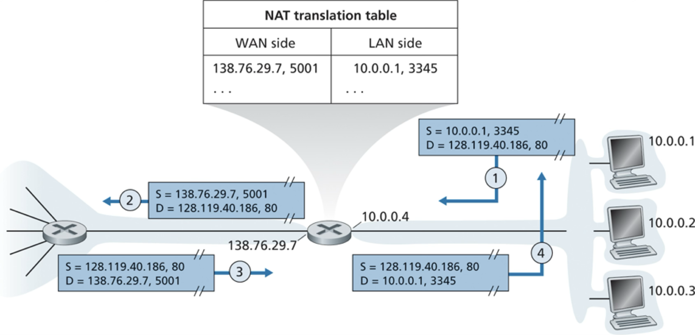

- Host 10.0.0.1 requests a web page from 128.119.40.186:80
- Host assigns a src port 3345 and sends datagram into LAN
- NAT router translates source IP and port to 138.76.29.7 5001 and sends datagram
- NAT router receives response datagram from web server and translates into local IP port and routes to host via home network

#### Exercises

1. Consider a subnet with prefix 128.119.40.128/26. Give an example of one IP address (of form xxx.xxx.xxx.xxx) that can be assigned to this network. Suppose an ISP owns the block of addresses of the form 128.119.40.64/26. Suppose it wants to create four subnets from this block, with each block having the same number of IP addresses. What are the prefixes (of form a.b.c.d/x) for the four subnets? <!-- NETWO-52sqI -->

     
     
     
     
     
     
     
     

[Back to the top](#network-layer)

---

### IPv6

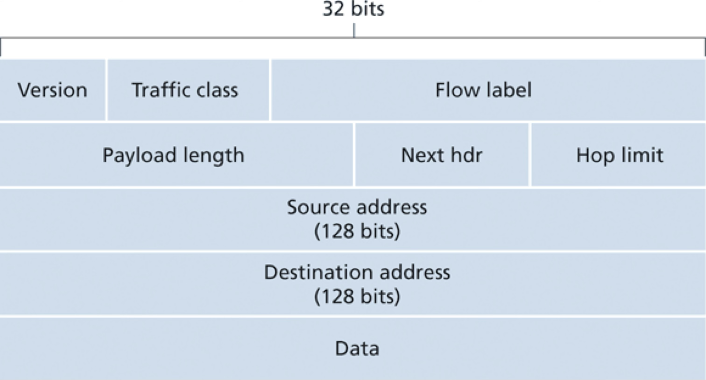

- Primary motivation: IPv4 address exhaustion
- IPv6 address: 128 bits or 16 bytes
  - (c.f. 4 bytes IPv4 address)
  - $2^{128}$ addresses (c.f. $2^{32}$ for IPv4)
  - every grain of sand is addressable
- Streamlined **40-byte header**
  - No fragmentation/reassembly
    - “Packet Too Big” ICMP error
  - No header checksum
    - Rely on Transport and Link layers
  - No Options section

#### Migrating from IPv4 to IPv6

- All routers on path from src to dest need to support IPv6
- Can’t shutdown the internet for a bit!
- Need to interoperate between the 2 versions
- Solution: **Tunneling**
  - Wrap IPv6 packet in IPv4 to tunnel through IPv4 routers
  - Set IPv4 upper protocol field to 41 so that the IPv6 receiver can unwrap

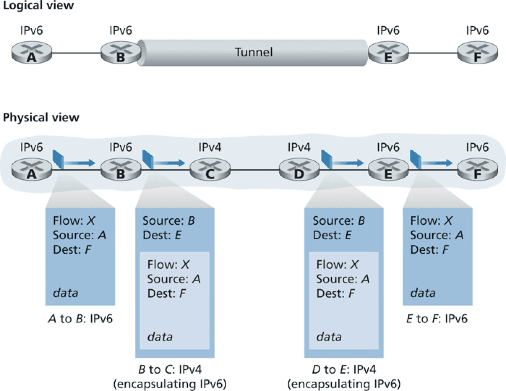

[Back to the top](#network-layer)

---

## Control Plane (Routing)

Recall:

> Routing = Determine good **end-to-end paths** and update router-local forwarding tables.

### Routing Algorithms

- Goal: determine *good* paths/routes, from senders to receivers, through network of routers
- “good”: least cost (e.g. length or speed or \$ of link)
  - respecting policy constraints
- **path/route**: sequence of routers from sender to receiver
- Formulation: graph G = (N, E)
  - set of N nodes (routers) and E edges (links)

Example routers graph:

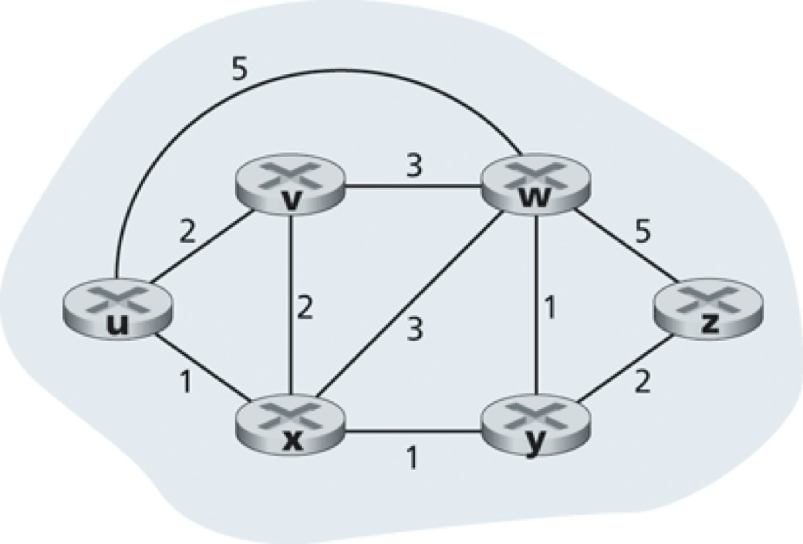

- Classification
  - **Centralized** aka **Link-State (LS)**
    - uses complete, global knowledge of network
  - **Decentralized** aka **Distance-Vector (DV)** and its extension **Path-Vector**
    - no node has complete information
    - nodes compute routes iteratively via exchanging info

### Link-State Routing Algorithm

- Complete knowledge => each node broadcasts link-state packets to all other nodes
  - Only feasible in small networks e.g. within an org
  - Example protocol: **OSPF** (Open Shortest Path First)
- **Dijkstra’s algorithm**
  - computes least-cost path from source node (e.g. $u$) to all other nodes
  - iterative: after kth iteration, paths known to k nodes
  - Notation
    - $D_u(v)$: cost of current least-cost path from $u$ to $v$
    - $N^\prime$: subset of nodes; $v$ is in $N^\prime$ if least-cost path to $v$ is known 

Djikstra dry-run for the following example graph using source node $u$:

1. Start with source node and its distance to its neighbors.
    
    $N^\prime = \{u\}$
    
    $D_u(v) = 2, D_u(w) = 5, D_u(x) = 1, D_u(y) = \infty , D_u(z) = \infty$

2. Pick closest node not in $N^\prime$ i.e. $x$

    $N^\prime = \{u, x\}, D_u(x) = 1$

    For each neighbor $a$ of $x$ not in $N^\prime$, update $D_u(a) = \text{min}(D_u(a), D_u(x) + D_x(a))$

    $D_u(v) = \text{min}(2, 1 + 2) = 2, D_u(w) = \text{min}(5, 1 + 3) = 4, D_u(y) = \text{min}(\infty, 1 + 1) = 2, D_u(z) = \infty$

3. Pick closest node not in $N^\prime$ i.e. $y$

    $N^\prime = \{u, x, y\}, D_u(x) = 1, D_u(y) = 2$

    For each neighbor $a$ of $y$ not in $N^\prime$, update $D_u(a) = \text{min}(D_u(a), D_u(y) + D_y(a))$

    $D_u(v) = 2, D_u(w) = \text{min}(4, 2 + 1) = 3, D_u(z) = \text{min}(\infty, 2 + 2) = 4$

4. Pick closest node not in $N^\prime$ (left as an exercise)

     
     
     
     
     
     
     
     

3. Pick closest node not in $N^\prime$ (left as an exercise)

     
     
     
     
     
     
     
     

4. Pick closest node not in $N^\prime$ i.e. $z$

    $N^\prime = \{u, x, y, v, w, z\}, D_u(x) = 1, D_u(y) = 2, D_u(v) = 2, D_u(w) = 3, D_u(z) = 4$

    $N^\prime$ contains all nodes, so done.

A slight enhancement to the above algorithm allows for tracking the *previous node* in the shortest path to a node, which in turn determines the shortest-path to each node from a single source node. 

#### Exercises

1. True or false: When an OSPF route sends its link state information, it is sent only to the directly attached neighbors. Explain. <!-- NETWO-mEjrr -->

     
     
     
     

1. Consider the following network. With the indicated link costs, uses Djikstra's shortes-path algorithm to compute the shortest path from $x$ to $u$, $w$, and $y$. <!-- NETWO-R6lfp -->

    
    
     
     
     
     
     
     
     
     
     
     
     
     

[Back to the top](#network-layer)

### Distance-Vector Routing Algorithm

- *Distributed*: each node exchanges info with direct neighbors
  - Feasible in large networks e.g. between orgs
  - Example protocol: **BGP** (Border Gateway Protocol)
- *Iterative*: continues until state converges (no more new info to exchange)
- *Asynchronous*: nodes operate independently, not in lock-step
- Based on the intuitive **Bellman-Ford equation**:
  - $D_x(y) = \text{min}_v(c(x, v) + D_v(y))$
- Extends to **Path-Vector** algorithm to track the end-to-end paths (not just the distances)

Example network of gateway routers:

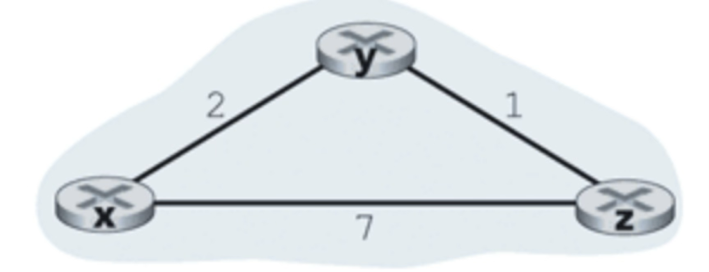

Example dry run:

0. Each node initializes a vector of distances to all nodes

    $\vec{D_x} = [0, 2, 7], \vec{D_y} = [2, 0, 1], \vec{D_z} = [7, 1, 0]$

1. $y$ sends its $\vec{D_y}$ to $x$

    $c(x, y) = 2$
    
    $\vec{D_x} = [0, 2, \text{min}(7, 2 + 1) = 3]$

1. $y$ sends its $\vec{D_y}$ to $z$

    $c(z, y) = 1$
    
    $\vec{D_z} = [\text{min}(7, 1 + 2) = 3, 1, 0]$

1. Every time a node's distance vector changes, it sends it to all its immediate neighbors.

1. Continue until the state converges in every node and the nodes stop sending updates.

#### Exercises

1. Consider the network shown below, and assume that each node initially knows the costs to each of its neighbors. Consider the distance-vector algorithm. <!-- NETWO-IllSd -->

    

     1. What is the initial distance vector at $z$?

         
         
         
         

     2. What is the updated distance vector at $z$ after it recives the initial distance vector from $x$?

         
         
         
         

    1. What is the updated distance vector at $z$ after it recives the initial distance vector from $v$?

         
         
         
         

[Back to the top](#network-layer)

---
