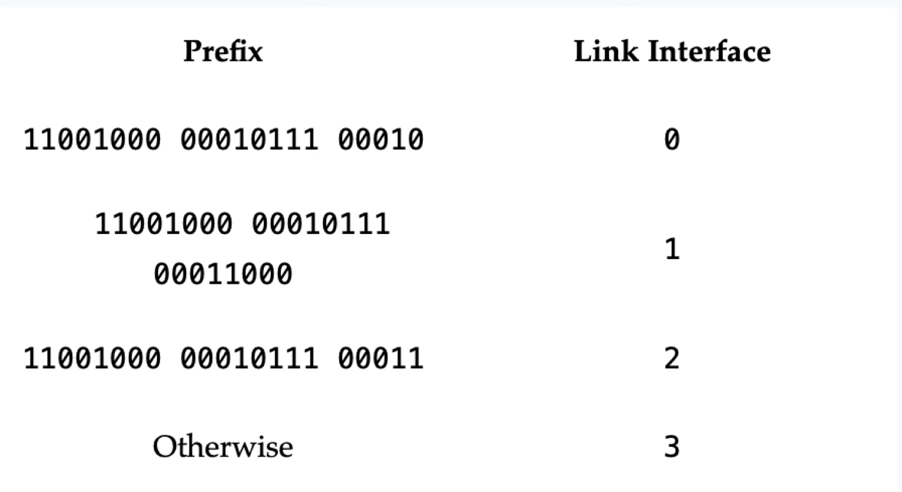
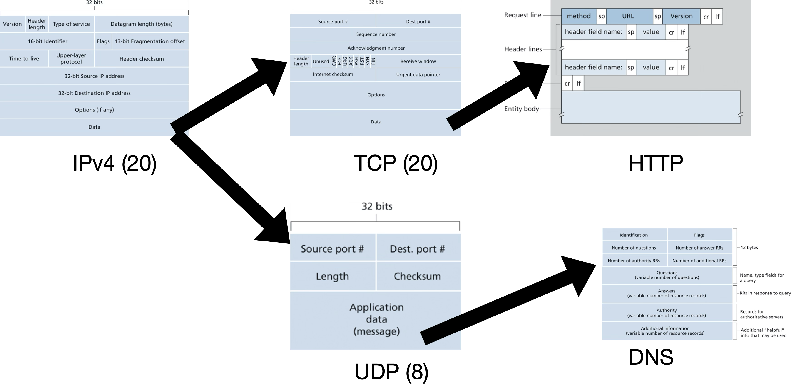

# Network Layer

Recommended reading: Kurose chapters 4 and 5

- [Network Layer](#network-layer)
  - [What Does It Do?](#what-does-it-do)
  - [How Does It Do It?](#how-does-it-do-it)
  - [Data Plane (Forwarding)](#data-plane-forwarding)
    - [How To Choose The Outgoing Link?](#how-to-choose-the-outgoing-link)
    - [What's In The Datagram Header?](#whats-in-the-datagram-header)
      - [IPv4](#ipv4)
      - [Layering Examples](#layering-examples)
      - [Addressing](#addressing)
        - [CIDR](#cidr)
        - [Address Allocation](#address-allocation)
        - [Network Address Translation (NAT)](#network-address-translation-nat)

## What Does It Do?

> [!IMPORTANT]
> The network layer moves datagrams from the sending host to the receiving host via intermediate routers.

- Example: host H1 sends msg to host H2
    - H1: ... -> transport segments -> network datagrams -> ...
    - H1 -> R1 -> … -> R2 -> H2
      - Up to network layer involved in each hop
    - H2: ... -> network datagrams -> transport segments -> ...
- Network layer used in all nodes in network:
    - hosts
    - packet-switches
        - link-layer switches
        - routers
- c.f. app and transport layers which are only used on end systems (hosts)

## How Does It Do It?

1. **Forwarding** (data plane)
    - Move datagram from **incoming link to appropriate outgoing link**
    - router-local
    - hardware (fast)
1. **Routing** (control plane)  
    - Determine good **end-to-end paths** and update router-local forwarding info
    - network-wide
    - software (slower)

Aside: Net Neutrality

- "With great power comes great responsibility"
- Routers control the flow of internet traffic
  - Can choose different scheduling mechanisms for queues
    - e.g. FIFO, Priority Queue, etc.
- BUT must follow US “net neutrality”: FCC 2015
  - No Blocking of lawful content
  - No Throttling of lawful traffic
  - No Paid Prioritization of some traffic

## Data Plane (Forwarding)

Recall:
- Forwarding = packet-switch moves a datagram from the **incoming link to an appropriate outgoing link**

### How To Choose The Outgoing Link?

- Use info in the network-layer header
- What info? the datagram's destination host identified by an IP address
- Known as **destination-based forwarding**
- **Forwarding table**:
  - map: destination-IP -> outbound-link
- Problem: too many possible destinations to track
  - e.g. ~4 billion IPv4 addresses
- Solution: **longest-prefix routing**
  - Hardware logic to match the longest prefix IP address entry in the forwarding table

Example forwarding table:

Exercises

1. Consider the network below. 

    

     1. What is router A's forwarding table entry such that all traffic destined to host H3 is forwarded through interface 3? <!-- NETWO-n65Ry --> 

     <pre>
     </pre>

    1. What is A's forwarding table entry such that all traffic from H1 to H3 uses interface 3 and all traffic from H2 to H3 uses interface 4? <!-- NETWO-gpJOU -->

    <pre>
    </pre>

2. Consider a datagram network using 8-bit host addresses. Suppose a router uses longest prefix matching and has the following forwarding table:

    | Prefix Match | Interface |
    | ------------ | --------- |
    | 1            | 0         |
    | 10           | 1         |
    | 111          | 2         |
    | otherwise    | 3         |

    For each of the four interfaces, give the associated range of destination host addresses and the number of addresses in the range. <!-- NETWO-BDwdV -->

    <pre>

    </pre>

### What's In The Datagram Header?

**IP (Internet Protocol)**
 1. IPv4
 2. IPv6

#### IPv4

- Version (4 bits)
  - 4 for IPv4, 6 for IPv6
  - First thing in the header, to know how to parse the rest of the header
- Header length (4 bits)
  - to account for Options (w/o options, 20 bytes)
- Type of service (8 bits)
  - e.g. real-time telephony vs non-real-time FTP
- Datagram length (16 bits)
  - header + data
- Identifier, flags, fragmentation offset (32 bits)
  - large datagram fragmentation and reassembly
  - removed in IPv6!
- Time-to-live
  - decremented by 1 at each router and discarded when 0
- Upper Protocol
  - used at destination host
  - TCP = 6, UDP = 17
  - Analogous to TCP segment port number
- Header checksum
  - bit errors in datagram
  - recomputed and stored at each router (e.g. TTL changes)
  - Removed in IPv6!
- **Src/dst IPv4 addresses**
- Options
  - rarely used
  - removed in IPv6!
- **Data**
  - typically, transport layer segment or network layer control msgs e.g. ICMP

#### Layering Examples

Exercises

1. How does IPv4 ensure that a datagram is forwarded through no more than N routers? <!-- NETWO-KpO6F -->

    <pre>
    </pre>

1. Suppose Host A sends Host B a TCP segment encapsulated in an IP datagram. When Host B receives the datagram, how does its network layer know it should pass the segment (i.e. the payload of the datagram) to TCP rather than to UDP or some other transport-layer protocol? <!-- NETWO-voEYl -->

    <pre>
    </pre>

1. Suppose an application generates chunks of 40 bytes of data every 30 msec, and each chunk is sent over the network via TCP and IPv4. What percentage of each network-layer datagram will be overhead (i.e. protocol headers)? <!-- NETWO-9xysP -->

    <pre>

    </pre>

#### Addressing

- **Network interface**
  - boundary between host/router and physical link
- IP address for every network interface
  - typically 1 for a host, many for a router
- 32 bits or 4 bytes => $2^{32}$ possible IPs
- Dotted-decimal notation e.g. 193.32.216.9
- Each IP globally unique (except for IPs behind NATs)

Example: one router interconnecting 7 hosts

- 24-bits common prefix for 3 hosts and 1 router interface (223.1.1.xxx)
  - **subnet** 
  - **subnet mask** 223.1.1.0/24 (“slash 24”)
  - LAN interconnected with no routers e.g. ethernet or WiFi
- Other subnets
  - 223.1.2.0/24 and 223.1.3.0/24

##### CIDR

- Classless Interdomain Routing (CIDR, pronounced cider)
- Internet’s address assignment strategy
- Generalizes the notion of subnet addressing
- 32-bit IP divided into two parts
- **a.b.c.d/x**
  - Prefix x bits = network prefix e.g. for an org
  - Internet routers use prefix to forward to org
    - Smaller forwarding tables
  - Remaining $32 - x$ bits address in-org hosts
    - used by org’s internal routers
    - can be further subnetted within org

##### Address Allocation

- Internet Corporation for Assigned Names and Numbers (ICANN)
- Non-profit that manages:
  - IP blocks allocation
  - DNS root servers
  - Domain name assignments
- Host IP within org with a block of IPs
  - Manually or Dynamic Host Configuration Protocol (DHCP)

##### Network Address Translation (NAT) 

- Host 10.0.0.1 requests a web page from 128.119.40.186:80
- Host assigns a src port 3345 and sends datagram into LAN
- NAT router translates source IP and port to 138.76.29.7 5001 and sends datagram
- NAT router receives response datagram from web server and translates into local IP port and routes to host via home network