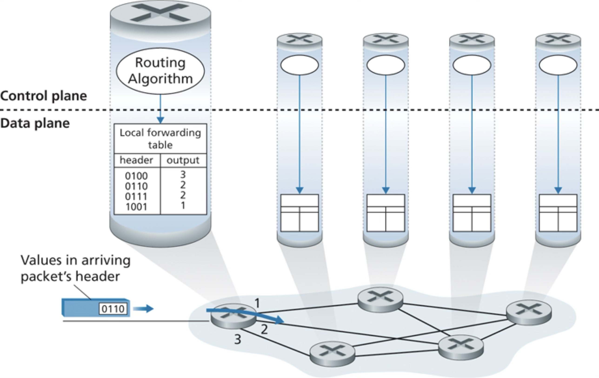

# Network Layer

Recommended reading: Kurose chapters 4 and 5

- [Network Layer](#network-layer)
  - [What Does It Do?](#what-does-it-do)
  - [How Does It Do It?](#how-does-it-do-it)
  - [Data Plane (Forwarding)](#data-plane-forwarding)
    - [How To Choose The Outgoing Link?](#how-to-choose-the-outgoing-link)
    - [IPv4](#ipv4)
      - [Addressing](#addressing)
      - [NAT](#nat)
    - [IPv6](#ipv6)
      - [Migration](#migration)
  - [Control Plane](#control-plane)

## What Does It Do?

> [!IMPORTANT]
> The network layer moves datagrams from the sending host to the receiving host via intermediate routers.

- Example: host H1 sends msg to host H2
    - H1: ... -> transport segments -> network datagrams -> ...
    - H1 -> R1 -> … -> R2 -> H2
      - Up to network layer involved in each hop
    - H2: ... -> network datagrams -> transport segments -> ...
- Network layer used in all nodes in network:
    - hosts
    - packet-switches
        - link-layer switches
        - routers
- c.f. app and transport layers which are only used on end systems (hosts)

## How Does It Do It?

1. **Forwarding** (data plane)
    - Move datagram from **incoming link to appropriate outgoing link**
    - router-local
    - hardware (fast)
1. **Routing** (control plane)  
    - Determine good **end-to-end paths** and update router-local forwarding info
    - network-wide
    - software (slower)

Aside: Net Neutrality

- "With great power comes great responsibility"
- Routers control the flow of internet traffic
  - Can choose different scheduling mechanisms for queues
    - e.g. FIFO, Priority Queue, etc.
- BUT must follow US “net neutrality”: FCC 2015
  - No Blocking of lawful content
  - No Throttling of lawful traffic
  - No Paid Prioritization of some traffic

## Data Plane (Forwarding)

Recall:
- Forwarding = packet-switch moves a datagram from the **incoming link to an appropriate outgoing link**

### How To Choose The Outgoing Link?

- Use info in the network-layer header
- What info? the datagram's destination host identified by an IP address
- Known as **destination-based forwarding**
- **Forwarding table**:
  - map: destination-IP -> outbound-link
- Problem: too many possible destinations to track
  - e.g. ~4 billion IPv4 addresses
- Solution: **longest-prefix routing**
  - Hardware logic to match the longest prefix IP address entry in the forwarding table

Example forwarding table:

Exercises

1. Consider the network below. 

    

     1. What is router A's forwarding table entry such that all traffic destined to host H3 is forwarded through interface 3? 

     <pre>
     </pre>

    2. What is A's forwarding table entry such that all traffic from H1 to H3 uses interface 3 and all traffic from H2 to H3 uses interface 4?

    <pre>
    </pre>
2. Consider a datagram network using 8-bit host addresses. Suppose a router uses longest prefix matching and has the following forwarding table:

    | Prefix Match | Interface |
    | ------------ | --------- |
    | 1            | 0         |
    | 10           | 1         |
    | 111          | 2         |
    | otherwise    | 3         |

    For each of the four interfaces, give the associated range of destination host addresses and the number of addresses in the range.

    <pre>

    </pre>

### IPv4

#### Addressing

#### NAT

### IPv6

#### Migration

## Control Plane