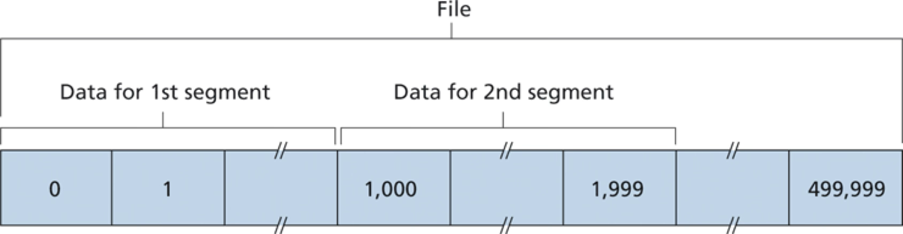

# Transport Layer

[Up to Overview](../index)

Recommended reading: Kurose chapter 3

- [Transport Layer](#transport-layer)
  - [Overview](#overview)
    - [Multiplexing and Demultiplexing](#multiplexing-and-demultiplexing)
    - [Internet's Transports](#internets-transports)
  - [UDP](#udp)
    - [Format](#format)
    - [Why UDP?](#why-udp)
  - [TCP](#tcp)
    - [Format](#format-1)
    - [Mux/Demux](#muxdemux)
    - [Connection](#connection)
    - [Buffers](#buffers)
    - [Reliability](#reliability)
      - [Sequence Numbers](#sequence-numbers)
      - [Acknowledgment Numbers](#acknowledgment-numbers)
      - [Retransmits](#retransmits)
    - [Flow Control](#flow-control)
      - [Window Scaling](#window-scaling)
    - [Congestion Control](#congestion-control)
      - [Slow Start](#slow-start)
      - [Congestion Avoidance](#congestion-avoidance)
    - [Disconnection](#disconnection)
    - [TCP States](#tcp-states)
      - [Client](#client)
      - [Server](#server)
    - [TCP Session on Wireshark](#tcp-session-on-wireshark)

## Overview

- Process-to-process channel (logical) 
- Only on the edge (hosts)  
  - not in the core (routers)

### Multiplexing and Demultiplexing

- Sender side multiplexing
    - App-layer message via 1 of N sockets -> 1 network-layer datagram
    - Encapsulation
        - wrap via prefixing header
        - message -> segment -> datagram
- Receiver side demultiplexing
    - 1 network-layer datagram -> app-layer message via 1 of N sockets
    - De-encapsulation
        - unwrap via removing header prefix
        - datagram -> segment -> message

Useful analogy:

- Two houses, one on East Coast and one on West Coast
  - house -> host
- Each house has a dozen kids
  - kid -> process
- Kids in one house are cousins of kids in other house
- Ever week, each kid writes a letter to every one of their cousins
  - letter -> message
- Ann (West Coast) and Bill (East Coast) collect letters and hand off to postal-service mail-carrier (and also deliver incoming letters to siblings)
  - Ann/Bill -> transport-layer
  - Postal-service -> network-layer

### Internet's Transports

- UDP (User Datagram Protocol)
    - Unreliable, connectionless (Ann/Bill careless)
- TCP (Transmission Control Protocol)
    - Reliable, connection-oriented (Ann/Bill careful)

[(Back to the top)](#transport-layer)

---

## UDP

### Format

- Defined in RFC 768
- **8 bytes** header
- Dest. port for receiver-side demultiplexing
    - (dest. IP, dest. port) -> Receiver socket
- Source port for receiver to reply to the sender (swapping src/dst ports aka “port inversion”)
- Length: # bytes in segment (header + data)
- Checksum: detect corruption/errors

Example of UDP transport encapsulating DNS app:

UDP on wireshark:

### Why UDP?

- Low latency (no connection establishment)
  - reason why DNS uses UDP
- App control over when data sent
  - No congestion control
- Handle more connections
  - No connection state overhead
- BUT typically need non-trivial app logic to address unreliability

[(Back to the top)](#transport-layer)

---

## TCP

### Format

- Defined in RFCs 793, 1122, 2018, 5681, 7323
- Src & dst ports, len, and checksum (ala UDP)
- Sequence & Acknowledgement numbers (for reliable data transfer)
- Receive window (for flow control)
- Header length (**20 bytes** w/o options) (c.f. 8 bytes for UDP)
- Options (variable length) (e.g. negotiate MSS or window scaling factor)
- 6 flag bits (details later)

Example of TCP transport encapsulating HTTP app:

### Mux/Demux

- Example
    - Host C has 2 HTTP sessions with host B
    - Host A has 1 HTTP session with host B
- TCP “listening socket” accepts connection and creates a connection-socket
- Connection socket identified by four-tuple: (src IP, src port, dst IP, dst port)
    - c.f. UDP two-tuple (dst IP, dst port)
    - Src port is used for demux in addition to port inversion in replies

### Connection

- **Three-way handshake**

    1. Client sends **SYN** segment (synchronize)

       - SYN + random initial-seq-num (isn)
       - 1st byte of sent data will have seq-num (sn) = isn+1
  
    2. Server responds with **SYNACK** segment

       - Allocates buffers/variables
       - SYN + random isn + ack
       - Ack sn = sn of byte the server expects to receive next

    1.  ACK segment

        - Allocates buffers/variables
        - next seq num (w/ piggybacked payload) + ack

- 1 RTT for connection establishment

Example SYN segment (wireshark):

Example SYNACK segment (wireshark):

Example ACK segment (wireshark):

### Buffers

- TCP buffers data on send/recv hosts
- Buffered data transmitted in segments
- **MSS**: max app data in segment
    - Not max segment size, despite the name!
    - Based on link-layer MTU (max transmission unit)
        - 1500 bytes for Ethernet
        - 40 bytes of TCP/IP headers => 1460 MSS
- Spec: “send data in segments at its own convenience”

### Reliability

- Guarantees
  - No lost data
  - No duplicate data
  - No out-of-order data
- How?
  - Sequence numbers
  - Acknowledgement numbers
  - Retransmits

#### Sequence Numbers

- Data = implicitly ordered stream of bytes
- Sequence number for segment = byte number of 1st data byte in segment (base initial-seq-num + 1)
- Example: message of 500,000 bytes, MSS of 1,000 bytes
  - Segment 1: seq-num offset 0
  - Segment 2: seq-num offset 1,000
  - … for 500 segments
- Random initial sequence number: protects against latent segments from a previous connection incarnation

#### Acknowledgment Numbers

- Example: echo server
- Set by the receiver of data
- Sequence number of the next data byte the receiver expects from the sender
- All data bytes up to that number have been successfully received
  - cumulative acknowledgement
  - Handling out of order segments is left up to the implementation (discard or buffer)

#### Retransmits

- Retransmit segment if not acked within timeout
- Timeout = estimated-RTT + 4 x deviation-RTT
  - estimated-RTT = exponentially-weighted-moving-average (EWMA)
- Resiliency against segment losses

### Flow Control

- Prevent sender from overflowing receive buffer
- Distinct from congestion control
- Receiver tracks receive window (**rwnd**) and includes it in every segment it sends to sender
- Sender keeps unacked bytes below rwnd

#### Window Scaling

- 16 bits rwnd => 64 Kilobytes of unacked data
- Bandwidth-delay product of a link
  - How much data is unacked in link
  - Long Fat Network (LFN)
    - e.g. 10 Mbit/s link with 100 ms propagation RTT
    - => 1 Mbit or ~125 KB unacked in link
    - => max of 64 KB rwnd too small!
- Left-shift amount in header options
    - 0 <= shift-at <= 14
    - Negotiated at handshake time
- So max rwnd = 214 x 216 bytes or ~ 1 GB
- From the trenches: often had to tweak window scaling for Amazon S3 customers reading data from far away

### Congestion Control

1. How does sender limit rate?

   - **cwnd**: congestion window
   - unacked-bytes <= min{cwnd, rwnd}
   - send rate ~ wnd/RTT bytes/sec

1. How does sender detect congestion?

   - Loss events
     - timeout for ack-wait
     - duplicate acks (when receiving out-of-order segments)

1. How does sender strike balance between congestion and throughput?

   - Acks => no congestion
     - Increase cwnd 
     - Rate of increase depends on acks arrival rate
   - Lost acks
     - Decrease cwnd
   - **Slow start** and **congestion avoidance**

#### Slow Start

- Start of TCP connection: cwnd = 1 MSS
- Every ack => cwnd = cwnd + 1 MSS
  - Exponential increase: doubles every RTT
    - cwnd (in MSS) = 1, 2, 4, 8, … 
  - When cwnd >= ssthresh (slow-start-threshold)
    - Transition to congestion-avoidance
- Loss event
  - restart slow start
  - ssthresh = cwnd / 2

#### Congestion Avoidance

- **Additive increase** rather than exponential increase
  - Every ack: cwnd = cwnd + MSS / cwnd 
    - => Every RTT: cwnd = cwnd + 1 MSS
  - c.f. slow-start
    - Every ack: cwnd = cwnd + 1 MSS
    - => every RTT: cwnd = cwnd * 2
- **Multiplicative decrease** on loss event
  - cwnd = cwnd / 2
- **AIMD** (Additive Increase Multiplicative Decrease)
  - sawtooth behavior of cwnd
- From the trenches: AIMD in app-layer congestion avoidance in Google’s cache-invalidation system

### Disconnection

- Either side can end the connection
- Resources (buffers/variables) released
- Example: client initiates close
  - Client closes only after
    - ACK received from server
    - FIN received from server
    - Wait time elapsed e.g. to resend a lost ack
  
### TCP States

#### Client

#### Server

### TCP Session on Wireshark

The following is a TCP session captured on wireshark for a localhost TCP server to whom a localhost netcat client sent the message "Hello" and then disconnected.

[(Back to the top)](#transport-layer)

---