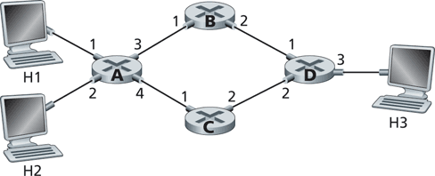

# Destination-Based Forwarding

- Use packet’s destination IP address to determine outbound link
- Problem of forwarding table size
  - IPv4: 32-bits => ~4 billion possibilities
  - Use prefix-based routing
    - Longest prefix matching rule
    - Implemented in hardware 

Example prefix-based forwarding table:
| Dest. IP prefix    | Link Interface    |
| ---                | --------------    |
| 1101               | 0                 |
| 1101001            | 1                 |
| 0101               | 2                 |
| *                  | 3                 |

## Exercises

Q. Consider the network below. 

What is the forwarding table entry such that all traffic destined to host H3 is forwarded through interface 3? 

<pre>
<!-- H3 -> 3-->
</pre>

What is the forwarding table entry such that all traffic from H1 to H3 uses interface 3 and all traffic from H2 to H3 uses interface 4?

<pre>
<!-- Not possible in destination-based forwarding -->
</pre>

Q. Consider a datagram network using 8-bit host addresses. Suppose a router uses longest prefix matching and has the following forwarding table:

| Prefix Match | Interface |
| ------------ | --------- |
| 1            | 0         |
| 10           | 1         |
| 111          | 2         |
| otherwise    | 3         |

For each of the four interfaces, give the associated range of destination host addresses and the number of addresses in the range.

<pre>

<!--
110xxxxx -> 0 (2^5)
10xxxxxx -> 1 (2^6)
111xxxxx -> 2 (2^5)
0xxxxxxx -> 3 (2^7)
-->

</pre>

## Net Neutrality

- Routers can use different packet scheduling mechanisms e.g. FIFO, Priority Queue, etc.
- US “net neutrality”: FCC 2015
    - No Blocking of lawful content
    - No Throttling of lawful traffic
    - No Paid Prioritization of some traffic