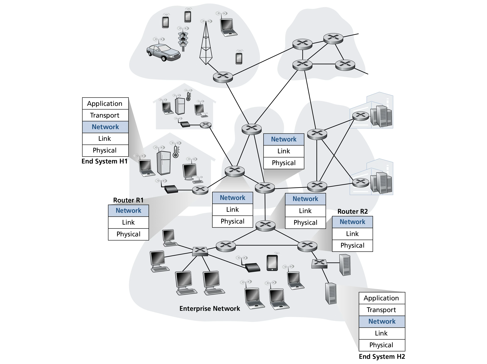
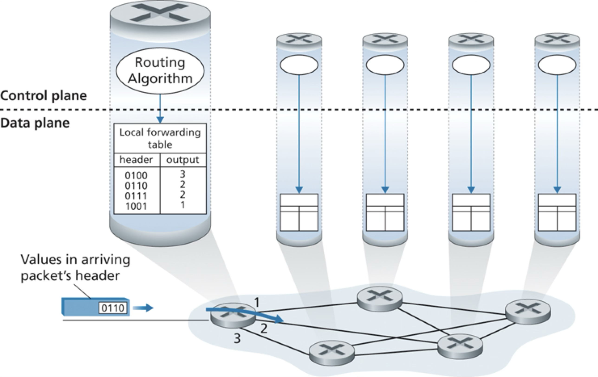

# Transport Layer

Recommended reading: Kurose chapters 4 and 5

- [Transport Layer](#transport-layer)
  - [Overview](#overview)
    - [What Does the Network Layer Do?](#what-does-the-network-layer-do)
  - [Data Plane](#data-plane)
    - [Forwarding](#forwarding)
    - [IPv4](#ipv4)
      - [Addressing](#addressing)
      - [NAT](#nat)
    - [IPv6](#ipv6)
      - [Migration](#migration)
  - [Control Plane](#control-plane)

## Overview

- Example
    - host H1 sends msg to host H2
        - H1: transport segments -> network datagrams
        - H1 -> R1 -> … -> R2 -> H2
          - Network layer involved in each hop
        - H2: network datagrams -> transport segments 
- Network layer in all nodes in network, including:
    - hosts
    - packet-switches
        - link-layer switches
        - routers
- Network layer processed in each node on src -> dst path
    - c.f. app and transport layers which are only processed on the end systems (hosts)

### What Does the Network Layer Do?

**Move datagrams from sending host to receiving host via intermediate routers**

How?

1. **Forwarding** (data plane)
    - incoming link -> outgoing link
    - router-local
    - hardware (fast)
1. **Routing** (control plane)  
    - end-to-end path
    - network-wide
    - software (slower)

## Data Plane

### Forwarding

### IPv4

#### Addressing

#### NAT

### IPv6

#### Migration

## Control Plane