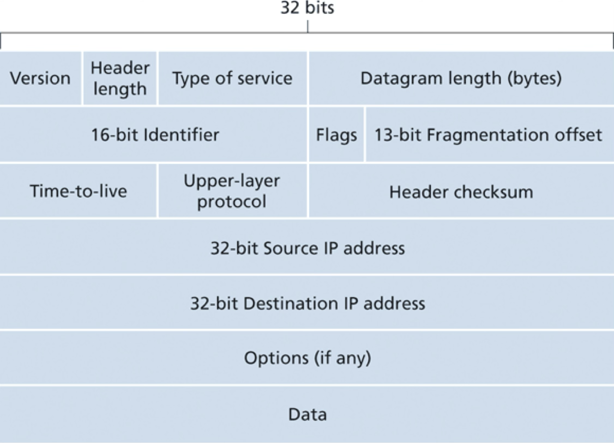

# IPv4 Protocol

## Exercises

Q. How does IPv4 ensure that a datagram is forwarded through no more than N routers?

<pre>
<!-- "TTL" field -->
</pre>

Q. Suppose Host A sends Host B a TCP segment encapsulated in an IP datagram. When Host B receives the datagram, how does its network layer know it should pass the segment (i.e. the payload of the datagram) to TCP rather than to UDP or some other transport-layer protocol?

<pre>
<!-- The "Upper-layer protocol" field in the IPv4 header -->
</pre>

Q. Suppose an application generates chunks of 40 bytes of data every 30 msec, and each chunk is sent over the network via TCP and IPv4. What percentage of each network-layer datagram will be overhead (i.e. protocol headers)?

<pre>
<!-- TCP: 20 bytes, IPv4: 20 bytes => 40 bytes overhade => 50% overhead -->
</pre>